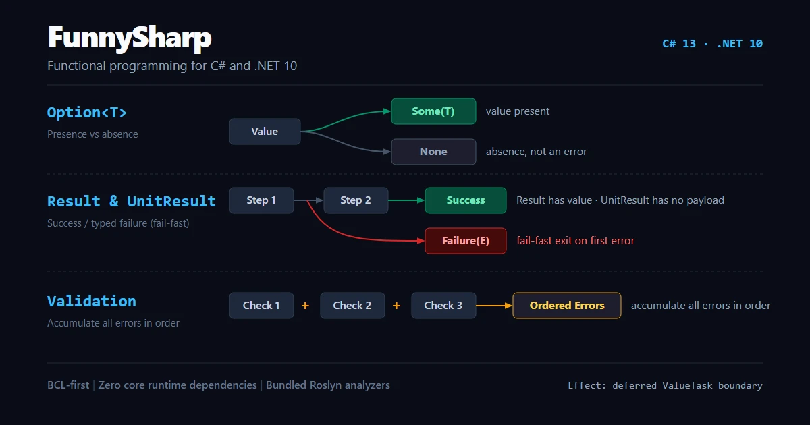

# FunnySharp: 面向 C# 与 .NET 10 的实用主义、BCL 优先函数式编程库

[](https://www.nuget.org/packages/FunnySharp) [](https://www.nuget.org/packages/FunnySharp.AspNetCore) [](https://dotnet.microsoft.com/) [](LICENSE)

[English](README.md) | [简体中文](README_zh-cn.md)



FunnySharp 是面向 C# 13 与 .NET 10 的实用主义、BCL 优先 C# 函数式编程库。
其 Option/Result 模式支持强类型错误处理与铁路导向编程（Railway-Oriented Programming，ROP），
基于标准 .NET 值、委托、`Task`、`ValueTask` 与 `IAsyncEnumerable<T>`。核心包没有运行时依赖，
并随包附带 Roslyn 静态分析器；独立的 `FunnySharp.AspNetCore` 包提供可选的 ASP.NET Core Minimal API 结果映射。

## 安装指南

```shell
dotnet add package FunnySharp              # Carriers, grammar, pipelines, analyzers (zero runtime dependencies)
dotnet add package FunnySharp.AspNetCore   # Optional Minimal API HTTP result mapping
```

## 核心语义载体一览

按结果的含义选择载体。`Map`、`Bind`、`Ensure`、`Match` 等共享动词仅适用于语义成立的载体；`Validation` 特意不提供 `Bind`。

| 载体 | 适用场景 | 行为 |
|---|---|---|
| `Option<T>` | 可能缺失的值 | `Some` 或 `None`；缺失不代表错误 |
| `Result<TValue, TError>` | 有返回值操作的强类型错误处理 | 遇到首个失败即短路 |
| `UnitResult<TError>` | 没有成功返回值的命令 | 遇到首个失败即短路 |
| `Validation<TValue, TError>` | 独立规则和批量输入校验 | 按确定性顺序累积错误 |

`Option<T>` 的默认值是合法 `None`。其余三种载体的默认值是未初始化状态，不是领域结果：读取状态时抛出 `InvalidOperationException`，`ToString()` 则返回诊断文本。`FS1001` 检查常见的默认值构造语法，并不覆盖所有可能的未初始化值。

`Effect<T>` 与 `Effect<TEnvironment, T>` 作为延迟执行的 `ValueTask` 边界，不作为第五类结果载体。

## 代码示例

### 1. 基于 Option 与 Result 的短路业务流

```csharp
using System;
using FunnySharp;

Option<string> sku = Option.Some("SKU-42");

Result<int, string> skuLength = sku
    .Map(static text => text.Length)
    .ToResult("The SKU is absent.")
    .Ensure(static length => length > 0, "The SKU is empty.");

string summary = skuLength.Match(
    success: static len => $"Valid SKU length: {len}",
    failure: static err => $"Validation failed: {err}");

Console.WriteLine(summary);
```

### 2. 独立多规则累加校验

```csharp
using System;
using FunnySharp;

var nameValidation = Validation<string, string>.Valid("Ada");
var ageValidation = Validation<int, string>.Invalid("Age must be at least 18.");
var codeValidation = Validation<string, string>.Invalid("Postal code is required.");

Validation<(string Name, int Age, string Code), string> registration =
    nameValidation.Zip(
        ageValidation,
        codeValidation,
        static (name, age, code) => (name, age, code));

registration.Match(
    valid: static user => Console.WriteLine($"Registered: {user.Name}"),
    invalid: static errors => Console.WriteLine($"Errors ({errors.Count}): {string.Join(", ", errors)}"));
```

## 核心功能特性

- **内置 Roslyn 静态分析器**：打包于核心包中（`FS1001` 拦截未初始化载体、`FS1002` 拦截丢弃的返回值、`FS1003` 检查忽略 `TryGet*` 布尔值的用法、`FS1004` 拦截 `ValueTask` 同步阻塞、`FS1005` 拦截异步资源同步释放）。
- **函数组合体系**：标准委托高阶扩展（`Pipe`、`Compose`、`Curry`、`Tap`）以及原生异步变体（`ComposeValueAsync`、`TapValueAsync`）。
- **数据流与切片管道**：为 `IEnumerable<T>` 与 `IAsyncEnumerable<T>` 提供单趟融合 `Choose` 与流式 `Scan`，为 `Span<T>` 提供调用方自持缓冲的 `ChooseTo`/`WhereTo`。
- **有界并发控制**：按源顺序（`SelectParallelValueAsync`）或完成顺序（`SelectParallelCompletionOrderValueAsync`）交付结果并行映射，以及针对冷 Effect 的 `FirstSuccessAsync` 竞争调度。
- **纯状态机与光学元件**：基于纯 `StateTransition` 驱动强类型命令输出，并通过轻量级 `Lens`/`Optional` 完成嵌套不可变更新。
- **ASP.NET Core Minimal API 映射**：通过 `FunnySharp.AspNetCore` 将载体和 Effect 映射为调用方指定的 `IResult` 和 RFC 7807/9457 `ProblemDetails`。

## 深入文档与工程示例

| 架构设计与权威契约 | 核心载体与语法指南 | 系统能力与生态集成 |
|---|---|---|
| [产品契约 (Product Contract)](https://github.com/wxxb789/funnysharp/blob/main/docs/product-contract.md) | [Option 指南 (Option Guide)](https://github.com/wxxb789/funnysharp/blob/main/docs/option.md) | [数据流管道 (Data Pipelines)](https://github.com/wxxb789/funnysharp/blob/main/docs/data-pipelines.md) |
| [动词语法表 (Grammar Reference)](https://github.com/wxxb789/funnysharp/blob/main/docs/grammar.md) | [Result 指南 (Result Guide)](https://github.com/wxxb789/funnysharp/blob/main/docs/result.md) | [并发控制指南 (Concurrency Guide)](https://github.com/wxxb789/funnysharp/blob/main/docs/concurrency.md) |
| [性能说明 (Performance Guidance)](https://github.com/wxxb789/funnysharp/blob/main/docs/performance.md) | [UnitResult 指南 (UnitResult Guide)](https://github.com/wxxb789/funnysharp/blob/main/docs/unit-result.md) | [副作用与资源 (Effects & Resources)](https://github.com/wxxb789/funnysharp/blob/main/docs/effects.md) |
| [发布就绪标准 (Release Readiness)](https://github.com/wxxb789/funnysharp/blob/main/docs/release-readiness.md) | [Validation 指南 (Validation Guide)](https://github.com/wxxb789/funnysharp/blob/main/docs/validation.md) | [状态机 (State Machines)](https://github.com/wxxb789/funnysharp/blob/main/docs/state-machines.md) |
| [版本控制规范 (Versioning Policy)](https://github.com/wxxb789/funnysharp/blob/main/docs/versioning.md) | [函数组合 (Function Composition)](https://github.com/wxxb789/funnysharp/blob/main/docs/function-composition.md) | [不可变更新 (Immutable Updates)](https://github.com/wxxb789/funnysharp/blob/main/docs/immutable-updates.md) |
| [快速入门 (Quick Start)](https://github.com/wxxb789/funnysharp/blob/main/docs/quick-start.md) | [静态分析器 (Roslyn Analyzers)](https://github.com/wxxb789/funnysharp/blob/main/docs/analyzers.md) | [ASP.NET Core 集成指南](https://github.com/wxxb789/funnysharp/blob/main/docs/aspnet-core.md) |
| [发布说明](https://github.com/wxxb789/funnysharp/blob/main/docs/release-notes.md) | [集合与遍历](https://github.com/wxxb789/funnysharp/blob/main/docs/collections.md) | [开发者 Harness](https://github.com/wxxb789/funnysharp/blob/main/docs/harness.md) |

可运行示例源码：[FunnySharp 核心示例](https://github.com/wxxb789/funnysharp/blob/main/examples/FunnySharp.Examples/Program.cs) 与 [ASP.NET Core 示例](https://github.com/wxxb789/funnysharp/blob/main/examples/FunnySharp.AspNetCore.Examples/Program.cs)。

## 性能、兼容性与开发验证

- **实测性能基准**：严苛的内存分配预算（`eng/performance/baseline.json`）对回归实施拦截；云端计时数据仅作方向性参考。
- **裁剪与 AOT 支持**：两款发布包均标记 `IsTrimmable=true` 并通过完整根分析验证。由于 .NET 10 编译器对开放泛型 `ValueTuple` 实例化的限制，不设置 `IsAotCompatible`；Native AOT 通过代表性封闭泛型消费者场景验证。
- **版本演进策略**：`0.x` 是预览候选版本，次版本更新可能按文档中的版本规则引入不兼容变更；`1.0.0` 起提供大版本兼容性承诺。
- **开发者工具要求**：要求本地安装 .NET SDK `10.0.400`（`rollForward: latestPatch`）。门禁通过 F# harness 执行：

```bash
dotnet fsi build.fsx -- -p build                 # Build solution FunnySharp.slnx
dotnet fsi build.fsx -- -p test                  # Execute xUnit v3 test suites
dotnet fsi build.fsx -- -p verify-docs-snippets  # Byte-exact documentation snippet verification
dotnet fsi build.fsx -- -p verify-tooling        # Contributor pre-check (locked restore, build, test, snippets)
```

完整发布验证调用参数及跨平台（Windows / Linux / macOS）门禁要求详见 [发布就绪标准 (release readiness)](https://github.com/wxxb789/funnysharp/blob/main/docs/release-readiness.md)。

## 开源许可证

FunnySharp 遵循 [MIT 开源许可证 (MIT License)](LICENSE)。
