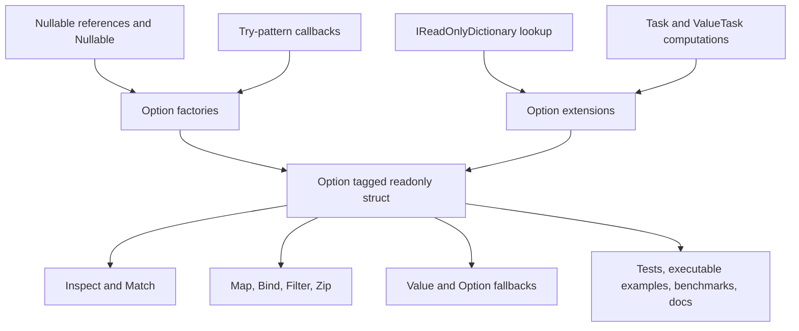
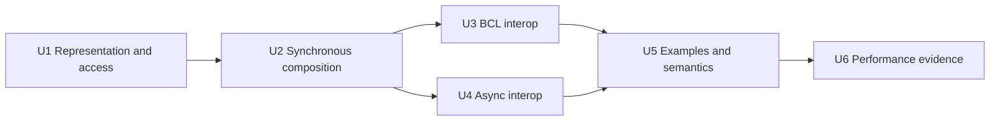

# Focused Option Abstraction - Plan

## Goal Capsule

- **Objective:** FunnySharp users can represent and compose absence without unsafe value access or ambiguous `null` semantics, while crossing common .NET absence boundaries predictably.
- **Means:** Add a tagged `Option<T>` value type, inference-friendly factories, and focused nullable, Try-pattern, dictionary, `Task`, and `ValueTask` bridges (KTD1-KTD7).
- **Authority:** `goals/03-goal.md` defines the feature outcome. `docs/product-contract.md` defines package and runtime boundaries. Existing function-composition code and evidence patterns define repository conventions.
- **Execution profile:** Implement behavior test-first. Land units in dependency order. Keep the shipping library free of third-party dependencies.
- **Tail ownership:** The active goal owns local implementation, simplification, review, and verification. Pushes and pull requests require separate user authorization.
- **Stop conditions:** Stop for a product decision if the proposed API cannot preserve the null, default-value, or failure semantics in this plan without widening into a general union, result, or collection system.

---

## Product Contract

### Summary

Add a small `Option<T>` abstraction for explicit presence or absence. The abstraction provides safe inspection, synchronous and asynchronous composition, and bridges to the .NET conventions that already encode absence.

### Problem Frame

.NET represents absence through several unrelated conventions: nullable references, `Nullable<T>`, `TryX(..., out value)` methods, collection lookup results, and completed asynchronous computations. Directly mixing these conventions forces callers to repeat branching logic and makes `null`, `default(T)`, missing values, and failed operations easy to conflate.

FunnySharp needs one focused abstraction that makes the absence branch explicit without replacing standard delegates, collections, tasks, or exceptions with a parallel runtime.

### Key Decisions

- **Absence is a two-case value, not a general union.** The feature exposes only `Some` and `None`. Governs R1, R13.
- **Present payloads are runtime non-null.** Nullable inputs and mapping results normalize `null` to `None`; explicit `Some(null)` is rejected. Governs R2, R8, R9, R10.
- **Value access stays total.** The public surface has no throwing `Value` property and no implicit conversion back to `T`. Governs R4.
- **Collection scope stops at dictionary lookup.** Sequence traversal and accumulation remain owned by `goals/05-goal.md`. Governs R9, R13.
- **Exceptions and cancellation remain failures, not absence.** A false Try result yields `None`; a true output still undergoes runtime-null normalization; arbitrary exceptions are never caught. Governs R5, R8, R10.

### Requirements

**Representation and safe access**

- R1. `default(Option<T>)` and every explicit `None` factory represent absence, while `Some(default(T))` represents presence for runtime-non-null defaults such as `0`, `false`, and non-nullable struct defaults.
- R2. `Some` rejects a runtime-null payload, while nullable conversion APIs normalize a runtime-null input to `None`.
- R3. Nested options preserve both layers, so `Some(None<T>())` differs from `None<Option<T>>()`.
- R4. Users can inspect state through `IsSome`, `IsNone`, `TryGetValue`, and `Match` without a public API that throws merely because the option is absent.
- R5. Equality and operators distinguish cases through `EqualityComparer<T>.Default`; equal options have equal hashes whose calculation includes the case tag, and debug text identifies the case.

**Composition and fallback**

- R6. `Map`, `Bind`, and `Filter` short-circuit `None`, invoke callbacks at most once, and obey the applicable functor and monad laws for callbacks that preserve the non-null payload invariant.
- R7. Users can combine two options with `Zip`, retrieve an explicit value fallback, retrieve `default(T)` by an explicitly named operation, or lazily choose a value or another option without overload ambiguity for `null` or `default` literals.

**.NET interoperation**

- R8. Nullable reference values, `Nullable<T>` values, and Try-pattern operations convert to options without conflating a successful non-null default payload with absence; dedicated nullable conversion unwraps `Nullable<T>` while generic transforms preserve their declared result type.
- R9. `IReadOnlyDictionary<TKey, TValue>` lookup returns an option that distinguishes a missing key from a present `default(TValue)` and normalizes a present runtime-null value to `None`.
- R10. `Task` and `ValueTask` bridges support mapping, binding, nullable-result conversion, and cancellation-aware callbacks without sync-over-async, eager cancellation, exception wrapping, or repeated `ValueTask` consumption.

**Evidence and package boundary**

- R11. xUnit v3 tests cover laws, representation edge cases, delegate validation, short-circuiting, exception identity, cancellation, and every interop boundary in R1-R10.
- R12. The executable example compiles and runs representative nullable, Try-pattern, dictionary, synchronous, `Task`, and `ValueTask` flows.
- R13. The shipping project keeps zero `PackageReference` entries and does not add a general discriminated union, result type, collection traversal layer, async wrapper type, or exception-catching helper.
- R14. BenchmarkDotNet measurements compare common option operations and conversions with equivalent direct C# or BCL code, and the documentation records both time and allocation results with environment context.

### Acceptance Examples

- AE1. Covers R1, R2, R4. Given `default(Option<int>)`, inspection reports `None`; given `Option.Some(0)`, inspection returns `0` without an exception.
- AE2. Covers R2, R8. Given a nullable reference or `int?` with no value, conversion returns `None`; a non-null reference or `int?` containing `0` returns `Some`.
- AE3. Covers R3, R5. Given `Option.Some(Option.None<int>())`, equality and matching observe a present outer option whose payload is an absent inner option.
- AE4. Covers R6, R7. Given `None`, transformations and lazy fallback alternatives do not run the unused callbacks; given `Some`, only the present branch runs.
- AE5. Covers R8, R9. Given a failed Try-pattern or a missing dictionary key, conversion returns `None`; a successful operation that yields a non-null default payload returns `Some`.
- AE6. Covers R10. Given a faulted or canceled asynchronous computation, awaiting the bridge observes the original failure semantics; given `None`, an async callback is not invoked even when the supplied token is already canceled.

### Key Flows

- F1. **Parse and lookup optional configuration**
  - **Trigger:** A consumer receives a nullable configuration string and must parse it before looking up related metadata.
  - **Steps:** Convert the nullable input, bind a bound Try-pattern parser, bind dictionary lookup, then choose one explicit fallback at the boundary.
  - **Outcome:** Missing input, parse failure, and missing lookup all follow the same visible absence branch, while thrown exceptions remain failures.
  - **Covered by:** R2, R6-R9; AE2, AE4, AE5.
- F2. **Transform an optional asynchronous result**
  - **Trigger:** A consumer awaits a Task or ValueTask whose successful result may be null, then conditionally performs another asynchronous transform.
  - **Steps:** Convert the nullable completion to an option, map or bind asynchronously, then match or provide a fallback.
  - **Outcome:** Successful absence short-circuits callbacks, while fault and cancellation remain distinguishable from absence.
  - **Covered by:** R2, R4, R6, R7, R10; AE4, AE6.

### Scope Boundaries

**Included**

- A single two-case `Option<T>` abstraction and its focused factory surface.
- Safe synchronous combinators and fallback operations.
- Nullable reference, `Nullable<T>`, Try-pattern, read-only dictionary, `Task`, and `ValueTask` interop.
- XML documentation, executable examples, xUnit v3 coverage, and comparative benchmarks.

**Deferred to Follow-Up Work**

- All `Option`/`Result` interoperation; `goals/04-goal.md` owns that public surface.
- Sequence, traversal, accumulation, and asynchronous collection combinators owned by `goals/05-goal.md`.
- LINQ query-syntax aliases such as `Select`, `SelectMany`, and `Where` unless a later goal demonstrates a concrete clarity benefit.
- Serialization converters, analyzers, source generators, and AOT- or trimming-specific guarantees.

**Outside this product's identity**

- A general-purpose discriminated-union hierarchy.
- An `AsyncOption`, option transformer, custom scheduler, or effect runtime.
- Automatic conversion of thrown exceptions or cancellation into `None`.
- Implicit conversion from `Option<T>` to `T` or a throwing absent-value accessor.

### Sources

- `goals/03-goal.md` defines the requested feature and evidence.
- `goals/04-goal.md` reserves explicit typed failures for `Result`.
- `goals/05-goal.md` reserves sequence traversal and accumulation.
- `docs/product-contract.md` defines the BCL-first, no-runtime-dependency, async, and performance boundaries.
- `src/FunnySharp/FunctionExtensions.cs` defines delegate validation, exception propagation, `ConfigureAwait(false)`, and `Task`/`ValueTask` naming patterns.
- `tests/FunnySharp.Tests/FunctionCompositionTests.cs` and `tests/FunnySharp.Tests/AsyncFunctionCompositionTests.cs` define law, short-circuit, exception-identity, cancellation, and one-consumption test patterns.
- `docs/function-composition.md`, `examples/FunnySharp.Examples/Program.cs`, and `benchmarks/FunnySharp.Benchmarks/FunctionCompositionBenchmarks.cs` define the documentation, compiling-example, and measurement evidence shape.
- [Nullable static analysis attributes](https://learn.microsoft.com/en-us/dotnet/csharp/language-reference/attributes/nullable-analysis) guides the `TryGetValue` postcondition annotation.
- [Exceptions and performance](https://learn.microsoft.com/en-us/dotnet/standard/design-guidelines/exceptions-and-performance) anchors the Boolean-returning Try-pattern boundary rather than exception-driven absence.
- [`ValueTask` remarks](https://learn.microsoft.com/en-us/dotnet/api/system.threading.tasks.valuetask?view=net-10.0) anchor the one-consumption requirement.

---

## Planning Contract

### Key Technical Decisions

- KTD1. **Use a tagged readonly value type.** `Option<T>` is a `readonly struct` with a presence tag and payload field. This makes the CLR default value a valid `None` while preserving runtime-non-null `Some(default(T))` values and avoiding per-value allocation.
- KTD2. **Keep construction closed and inference-friendly.** The generic type owns the invariant-preserving `Some` factory and `None` value. A non-generic `Option` factory forwards `Some`, `None`, nullable conversion, and Try-pattern construction for type inference. No public constructor is needed.
- KTD3. **Expose only total access paths.** `TryGetValue` uses an `out T?` parameter with `NotNullWhen(true)` so a successful branch establishes the runtime non-null invariant even for `Option<string?>`. `Match`, explicit fallback methods, and `GetValueOrDefault` cover retrieval without adding `.Value`, `TryGetValue` exceptions, or implicit unwrapping.
- KTD4. **Apply one internal runtime-null normalizer.** Explicit `Some` and eager value fallbacks reject runtime-null before state inspection. Nullable input, Try success output, dictionary hit output, `Map`, async `Map`, and async nullable completion convert runtime-null to `None`. A lazy value fallback rejects a runtime-null result only when the `None` branch invokes it. `Match` may return null because it exits the option abstraction. `GetValueOrDefault` may return null or another default because its name makes that policy explicit.
- KTD5. **Keep synchronous callbacks eager-validated and branch-lazy.** Every delegate argument is checked at API entry, including on `None`. Only the selected branch or required transformation executes, and callback exceptions propagate unchanged.
- KTD6. **Bridge Try APIs with one out delegate and dictionary lookup with one extension.** `TryOperation<T>` returns `bool` and marks its out value `MaybeNull`, because a true result may still yield runtime-null and normalize to `None`. `FromTry` invokes the operation once and never catches it. `GetOption` invokes `IReadOnlyDictionary<TKey, TValue>.TryGetValue` exactly once, validates only the receiver, passes the key through unchanged, and propagates the concrete dictionary's exceptions.
- KTD7. **Separate callback return kinds without inventing wrappers.** Task callbacks use `MapAsync` and `BindAsync`; ValueTask callbacks use `MapValueAsync` and `BindValueAsync`. Nullable Task and ValueTask receivers both use unambiguous `ToOptionAsync` overloads because the receiver type distinguishes them. Cancellation-aware callback overloads pass the exact token and do not inspect it eagerly.
- KTD8. **Use standard payload equality.** `None` equals `None`. Present options compare through `EqualityComparer<T>.Default`. Hash calculation includes the case tag and payload hash, but unequal values are not promised distinct hashes. Mutable reference payloads retain normal .NET equality and dictionary-key caveats.
- KTD9. **Treat text as diagnostic, not serialized data.** `ToString` renders `None` or `Some(payload)` for debugging. Documentation does not promise a stable serialization or UI display format.
- KTD10. **Measure wrappers against equivalent direct branches.** Each benchmark category pairs a direct C# or BCL baseline with the FunnySharp operation and records construction separately where delegate creation would otherwise distort invocation cost.

### Public API Contract

The member inventory below is the compatibility boundary for this goal. It fixes names, type shapes, generic constraints, annotations, and overload distinctions without prescribing method bodies.

| Owner | Member shape | Result | Contract |
| --- | --- | --- | --- |
| `Option<T>` | `readonly struct`; no generic constraint; implements `IEquatable<Option<T>>` | Value type | The default struct value is `None`; there is no public constructor. |
| `Option<T>` | Static property `None { get; }` and `Some([DisallowNull] T value)` | `Option<T>` | `Some` rejects runtime-null. |
| `Option` | `None<T>()` and `Some<T>([DisallowNull] T value)` | `Option<T>` | Inference-friendly forwards to the generic owner. |
| `Option` | `FromNullable<T>(T? value)` for `T : class` | `Option<T>` | Null becomes `None`; non-null becomes `Some`. |
| `Option` | `FromNullable<T>(Nullable<T> value)` for `T : struct` | `Option<T>` | No value becomes `None`; a contained `default(T)` remains `Some`. |
| `TryOperation<T>` | Boolean delegate with `[MaybeNull] out T value` | `bool` | Expresses a bound Try-pattern without claiming that true implies a non-null output. |
| `Option` | `FromTry<T>(TryOperation<T> operation)` | `Option<T>` | False becomes `None`; true passes the output through runtime-null normalization. |
| `Option<T>` | `IsSome` and `IsNone` | `bool` | Complementary state checks. |
| `Option<T>` | `TryGetValue([NotNullWhen(true)] out T? value)` | `bool` | True establishes a non-null output; false writes `default(T)`. |
| `Option<T>` | `Match<TResult>(Func<T, TResult> some, Func<TResult> none)` and `Match(Action<T> some, Action none)` | `TResult` or `void` | Both delegates validate eagerly; exactly one executes; `TResult` may be runtime-null. |
| `Option<T>` | `Map<TResult>(Func<T, TResult> selector)` | `Option<TResult>` | Preserves declared `TResult`; runtime-null becomes `None`. |
| `Option<T>` | `Bind<TResult>(Func<T, Option<TResult>> binder)` | `Option<TResult>` | Returns the callback option unchanged. |
| `Option<T>` | `Filter(Func<T, bool> predicate)` | `Option<T>` | Keeps a matching `Some`; otherwise returns `None`. |
| `Option<T>` | `Zip<TSecond>(Option<TSecond> second)` | `Option<(T First, TSecond Second)>` | Returns a named tuple only when both inputs are present. |
| `Option<T>` | `[return: NotNull] GetValueOr([DisallowNull] T fallback)` | `T` | Validates the eager fallback for runtime-null before inspecting state. |
| `Option<T>` | `[return: NotNull] GetValueOrElse(Func<T> fallbackFactory)` | `T` | Validates the delegate eagerly; invokes it only for `None`; rejects a runtime-null result. |
| `Option<T>` | `[return: MaybeNull] GetValueOrDefault()` | `T` | Returns the payload or `default(T)` and is the only value fallback that may return runtime-null. |
| `Option<T>` | `OrElse(Option<T> fallback)` | `Option<T>` | Returns the receiver when present and the supplied option when absent. |
| `Option<T>` | `OrElseWith(Func<Option<T>> fallbackFactory)` | `Option<T>` | Validates the delegate eagerly and invokes it only for `None`. |
| `Option<T>` | Equality members, `==`, `!=`, `GetHashCode`, and `ToString` | Standard value semantics | Uses KTD8-KTD9. |
| Nullable extensions | `ToOption<T>` overloads matching both `FromNullable` forms | `Option<T>` | Extension syntax for known class and struct nullable types; unconstrained generic nullable callers are not widened by reflection or dynamic dispatch. |
| Dictionary extension | `GetOption<TKey, TValue>(this IReadOnlyDictionary<TKey, TValue> source, TKey key)` with no added key constraint | `Option<TValue>` | Performs one `TryGetValue`; preserves declared `TValue`; normalizes runtime-null. |
| Async option extension | `MapAsync<T, TResult>(this Option<T> option, Func<T, Task<TResult>> selector)` | `Task<Option<TResult>>` | Validates the selector synchronously; callback failures are observed through the returned Task. |
| Async option extension | `MapAsync<T, TResult>(this Option<T> option, Func<T, CancellationToken, Task<TResult>> selector, CancellationToken cancellationToken)` | `Task<Option<TResult>>` | The callback receives `(value, cancellationToken)` in that order. |
| Async option extension | `BindAsync<T, TResult>(this Option<T> option, Func<T, Task<Option<TResult>>> binder)` | `Task<Option<TResult>>` | Returns the awaited option unchanged. |
| Async option extension | `BindAsync<T, TResult>(this Option<T> option, Func<T, CancellationToken, Task<Option<TResult>>> binder, CancellationToken cancellationToken)` | `Task<Option<TResult>>` | The callback receives `(value, cancellationToken)` in that order. |
| Async option extension | `MapValueAsync<T, TResult>(this Option<T> option, Func<T, ValueTask<TResult>> selector)` | `ValueTask<Option<TResult>>` | Validates the selector synchronously and consumes its ValueTask once. |
| Async option extension | `MapValueAsync<T, TResult>(this Option<T> option, Func<T, CancellationToken, ValueTask<TResult>> selector, CancellationToken cancellationToken)` | `ValueTask<Option<TResult>>` | The callback receives `(value, cancellationToken)` in that order. |
| Async option extension | `BindValueAsync<T, TResult>(this Option<T> option, Func<T, ValueTask<Option<TResult>>> binder)` | `ValueTask<Option<TResult>>` | Returns the awaited option unchanged and consumes its ValueTask once. |
| Async option extension | `BindValueAsync<T, TResult>(this Option<T> option, Func<T, CancellationToken, ValueTask<Option<TResult>>> binder, CancellationToken cancellationToken)` | `ValueTask<Option<TResult>>` | The callback receives `(value, cancellationToken)` in that order. |
| Async nullable extension | `ToOptionAsync<T>(this Task<T?> task)` for `T : class` and `ToOptionAsync<T>(this Task<Nullable<T>> task)` for `T : struct` | `Task<Option<T>>` | Validates a null Task receiver and unwraps nullable completion only in this dedicated conversion. |
| Async nullable extension | `ToOptionAsync<T>(this ValueTask<T?> task)` for `T : class` and `ToOptionAsync<T>(this ValueTask<Nullable<T>> task)` for `T : struct` | `ValueTask<Option<T>>` | Awaits the receiver once; a default ValueTask normalizes its default nullable result. |

Generic operations preserve their declared type parameter. For example, `Map<int?>`, `FromTry<int?>`, `GetOption<TKey, int?>`, and async mapping return `Option<int?>`; a runtime-null nullable payload becomes `None`, while a contained `0` becomes `Some`. The dedicated `FromNullable<int>(int?)`, `ToOption<int>(int?)`, and `ToOptionAsync<int>(Task<int?> or ValueTask<int?>)` conversions unwrap the nullable wrapper and return `Option<int>`.

### High-Level Technical Design

The public surface has one state-owning core and one interop layer. Evidence projects consume the public API rather than internal hooks.



The async call path validates the callback synchronously, then enters a small private async core only for `Some`. That core awaits exactly once with `ConfigureAwait(false)` and applies the same null normalization as synchronous `Map`. `None` returns a completed absent result without invoking the callback or observing the token. A callback that throws before returning an awaitable is therefore represented by the returned Task or ValueTask: ordinary exceptions fault it, while `OperationCanceledException` produces normal canceled-operation semantics.

### API Behavior Matrix

| Input or operation | Present non-null result | Runtime-null result | Failure or cancellation |
| --- | --- | --- | --- |
| Explicit `Some` | `Some` | Throw `ArgumentNullException` | Not applicable |
| Nullable reference / `Nullable<T>` conversion | `Some<T>` with nullable wrapper removed | `None<T>` | Not applicable |
| Generic `Map` / async map | `Some<TResult>` with declared result type preserved | `None<TResult>` | Propagate callback failure |
| `Bind` / async bind | Return callback option unchanged | Callback must return an option value | Propagate callback failure |
| Try-pattern bridge | `Some<T>` when Boolean is true | `None<T>` | False is `None`; thrown exceptions propagate |
| Dictionary lookup | `Some<TValue>` when found | `None<TValue>` | Missing key is `None`; dictionary exceptions propagate |
| `GetValueOr` | `Some` returns its payload; `None` returns the eager fallback | Reject a runtime-null fallback before state inspection | Not applicable |
| `GetValueOrElse` | `Some` returns its payload without invoking the factory; `None` invokes it once | Reject runtime-null only when the invoked factory returns it | Factory failure propagates |
| `GetValueOrDefault` | Return payload | Return `default(T)` on `None` | Not applicable |
| `Match` | Return selected branch result | Allowed as the caller-selected result | Branch failure propagates |

### Sequencing



### System-Wide Impact

- The first `Option<T>` release establishes a public NuGet contract whose type kind, default behavior, member names, and null semantics will be expensive to change later.
- `src/FunnySharp/FunnySharp.csproj` must remain dependency-free. Test and benchmark packages stay in non-packable projects.
- The nullable annotations affect consumer compiler flow analysis and must be verified through compiling call sites, not only runtime assertions.
- Async bridges add overload surface but no new runtime abstraction. Their behavior must remain consistent with function composition and future `Result` interop.

### Risks and Mitigations

- **Nullable overload ambiguity:** Reference and `Nullable<T>` conversions can infer unexpected generic types. Keep the overload family small and prove representative calls in tests and the executable example.
- **Public API overgrowth:** Convenience aliases can become permanent compatibility obligations. Limit this goal to the named factories, core combinators, dictionary lookup, and async bridges in the requirements.
- **Large struct copies:** A value-type option copies its payload. Benchmark common scalar/reference payloads, document the trade-off, and avoid speculative layout or inlining attributes without measurement.
- **Async allocation:** Task variants naturally allocate where the direct equivalent does. Measure completed Task and ValueTask paths separately and do not claim zero overhead.
- **Mutable payload equality:** Standard comparer behavior can make a key unstable after payload mutation. Document that the option neither deep-copies nor supplies a custom comparer.
- **Diagnostic text dependency:** Consumers may begin relying on `ToString`. State that it is diagnostic and omit serialization guarantees.

### Alternative Approaches Considered

- **Nullable values alone:** Rejected because they cannot uniformly represent generic reference/value absence, preserve nested absence, or distinguish missing from `Some(default(T))`.
- **Reference-type option:** Rejected because a null option reference creates a third invalid state and every `Some` allocation conflicts with the intended small value abstraction.
- **General discriminated union:** Rejected by the goal and product contract. It expands the type system far beyond absence.
- **Exception-catching factory:** Rejected because exceptions and cancellation are failures. `goals/04-goal.md` owns explicit failure conversion.
- **Sequence lookup and traversal family:** Deferred to `goals/05-goal.md` to avoid accidental collection-framework growth.
- **Async wrapper type:** Rejected in favor of standard `Task<Option<T>>` and `ValueTask<Option<T>>` return types.

---

## Implementation Units

### U1. Establish representation and safe access

- **Goal:** Add the invariant-preserving `Option<T>` representation, factories, inspection, matching, equality, hashing, operators, and diagnostic text.
- **Requirements:** R1-R5, R11, R13; AE1, AE3.
- **Dependencies:** None.
- **Files:**
  - `src/FunnySharp/Option.cs`
  - `tests/FunnySharp.Tests/OptionTests.cs`
- **Approach:** Implement KTD1, the construction/inspection portions of KTD2-KTD5, and KTD8-KTD9 in the core file. U2 applies the remaining synchronous-composition and fallback rules; U3-U4 apply the interop and async portions. Keep fields private and construction closed. Use the generic comparer rather than custom payload semantics.
- **Execution note:** Start from failing representation and safe-access tests. Observe that missing public types or behavior fail before adding production code.
- **Patterns to follow:** `src/FunnySharp/FunctionExtensions.cs` for namespace, XML documentation, and eager delegate validation; `tests/FunnySharp.Tests/FunctionCompositionTests.cs` for law and exception-identity assertions.
- **Test scenarios:**
  - Covers AE1. `default(Option<int>)`, `Option<int>.None`, and `Option.None<int>()` are equal and report absence.
  - Covers AE1. `Some(0)`, `Some(false)`, and `Some(default(DateTime))` report presence and retain their payloads.
  - Explicit `Some<string>(null)` and `Option<string>.Some(null)` throw `ArgumentNullException`.
  - Covers AE3. `Some(None<int>())` differs from `None<Option<int>>()` and exposes the inner `None` through `TryGetValue`.
  - `TryGetValue` returns true and the payload for `Some`; it returns false and `default(T)` for `None`.
  - A warnings-as-errors consumer can dereference an `Option<string?>` output inside the successful `TryGetValue` branch without a nullable warning.
  - Result-returning and action-returning `Match` invoke exactly one branch.
  - Both result-returning `Match<string?>` branches may deliberately return runtime-null without constructing an option or throwing.
  - Both `Match` callbacks are validated eagerly for `Some` and `None`.
  - Branch exceptions retain the original exception instance.
  - Equal present payloads, including a custom `IEquatable<T>` payload, compare equal through instance equality, object equality, operators, and `EqualityComparer<Option<T>>.Default`, and produce equal hashes.
  - Default and explicit `None` produce equal hashes; `None`, runtime-non-null `Some(default(T))`, unequal payloads, and nested payloads remain unequal without asserting that unequal values must have distinct hashes.
  - `ToString` distinguishes `None` and `Some(payload)` without becoming a serialization test.
- **Verification:** Focused core tests pass, the public type emits no nullable or XML documentation warnings, and package boundary tests remain green.

### U2. Add synchronous composition and fallbacks

- **Goal:** Add lawful transformations, filtering, combination, and explicit eager/lazy fallback operations.
- **Requirements:** R2, R6, R7, R11; AE4.
- **Dependencies:** U1.
- **Files:**
  - `src/FunnySharp/Option.cs`
  - `tests/FunnySharp.Tests/OptionTests.cs`
- **Approach:** Add `Map`, `Bind`, `Filter`, `Zip`, `GetValueOr`, `GetValueOrElse`, `GetValueOrDefault`, `OrElse`, and `OrElseWith` under KTD4-KTD5. Distinct lazy names prevent `null` and `default` literal overload ambiguity. Keep operations allocation-free except for caller-provided delegates and closures.
- **Execution note:** Add each behavior slice test-first. Preserve the red evidence for law, short-circuit, and null-policy failures before implementing the slice.
- **Patterns to follow:** `tests/FunnySharp.Tests/FunctionCompositionTests.cs` for direct law assertions, call counters, eager guards, and `Assert.Same` exception checks.
- **Test scenarios:**
  - `Map` obeys identity and composition for both `Some` and `None` when every selector preserves the runtime non-null payload invariant.
  - When an intermediate selector returns runtime-null, `Map` returns `None` and later chained selectors do not run; this normalization case is documented outside the composition-law claim.
  - `Bind` obeys left identity, right identity, and associativity across present and absent paths.
  - `Map<string?>` and `Map<int?>` preserve the declared result type while normalizing a runtime-null result to `None` and retaining a contained non-null/default value.
  - Mapping a present `Option.None<T>()` payload produces `Some(None<T>())`, not outer `None`.
  - `Map`, `Bind`, and `Filter` validate callbacks eagerly and never invoke them for `None`.
  - Callback exceptions from `Map`, `Bind`, and `Filter` preserve identity.
  - `Filter` retains a matching payload and converts a non-matching payload to `None`.
  - `Zip` returns a tuple only when both sides are present, including `Some(default(T))` and nested option payloads.
  - `GetValueOr` and `GetValueOrElse` return the present value for `Some` and the fallback for `None`.
  - `GetValueOr` rejects runtime-null even for `Some`; `GetValueOrElse` does not invoke or validate its produced value for `Some`, but rejects a runtime-null result when invoked for `None`.
  - Lazy value and option fallbacks are not invoked for `Some` and are invoked exactly once for `None`.
  - `OrElse` and `OrElseWith` preserve the selected option without flattening nested options and compile unambiguously for explicit `None`, `default(Option<T>)`, and null factory arguments.
  - Fallback factory exceptions retain identity.
- **Verification:** All synchronous option tests pass and no callback is invoked outside the branch named by the option state.

### U3. Bridge nullable, Try, and dictionary absence

- **Goal:** Convert common synchronous .NET absence conventions into options through a small, explicit interop surface.
- **Requirements:** R2, R8, R9, R11, R13; F1; AE2, AE5.
- **Dependencies:** U1, U2.
- **Files:**
  - `src/FunnySharp/Option.cs`
  - `src/FunnySharp/OptionExtensions.cs`
  - `tests/FunnySharp.Tests/OptionInteropTests.cs`
- **Approach:** Implement KTD2, KTD4, and KTD6. Use separate nullable reference and `Nullable<T>` entry points where C# type inference requires them. Keep generic Try and dictionary results at their declared `T`/`TValue` type. Bind Try APIs with input parameters through a caller lambda rather than promising every method-group shape.
- **Execution note:** Compile representative nullable calls before filling the implementation so overload-resolution mistakes fail early.
- **Patterns to follow:** Existing public extension methods in `src/FunnySharp/FunctionExtensions.cs`; BCL `TryGetValue` Boolean/out semantics.
- **Test scenarios:**
  - Covers AE2. A nullable reference converts to `None` when null and `Some` when non-null through both factory and extension syntax.
  - Covers AE2. `Nullable<int>` converts no-value to `None`, `0` to `Some(0)`, and a non-default value to `Some`.
  - Directly instantiated `Option<string?>` and `Option<int?>` still reject a runtime-null `Some` while preserving a non-null nullable payload.
  - `FromNullable(int?)` returns `Option<int>`, while `FromTry<int?>`, dictionary lookup with `TValue=int?`, and generic mapping retain `Option<int?>`; representative assignments compile under warnings-as-errors.
  - Covers AE5. `FromTry` accepts a matching zero-input method group, returns `Some` on true with a non-null payload, and returns `None` on false even if the out variable contains a non-default value.
  - A bound-input lambda adapts `int.TryParse` or an equivalent Try API without adding an overload per input arity.
  - `FromTry` converts true with a runtime-null output to `None`.
  - `FromTry` validates its delegate eagerly, invokes it once, and preserves a thrown exception instance.
  - `FromTry<Option<int>>` with a true result and an inner `None` returns `Some(None<int>())`.
  - Nullable conversion of a present inner `Option.None<T>()` returns `Some(None<T>())`.
  - Covers AE5. `GetOption` distinguishes a missing key from a key mapped to `0` or another non-null default payload.
  - A dictionary key mapped to a runtime-null reference or empty `int?` converts to `None`; a key mapped to inner `None` returns `Some(None<T>())`.
  - A fake `IReadOnlyDictionary` proves `GetOption` calls `TryGetValue` exactly once and never uses `ContainsKey` or the indexer.
  - A null dictionary argument is rejected eagerly; the key is passed through unchanged and concrete dictionary exceptions propagate.
  - Concrete `Dictionary<TKey, TValue>` and `IReadOnlyDictionary<TKey, TValue>` call sites compile without ambiguous extensions.
- **Verification:** Interop tests compile under nullable warnings-as-errors and pass without adding dependencies or sequence APIs.

### U4. Add Task and ValueTask interop

- **Goal:** Compose options with asynchronous callbacks and nullable asynchronous results while preserving standard failure, cancellation, and consumption behavior.
- **Requirements:** R2, R6, R8, R10, R11, R13; F2; AE6.
- **Dependencies:** U1, U2.
- **Files:**
  - `src/FunnySharp/OptionExtensions.cs`
  - `tests/FunnySharp.Tests/OptionAsyncTests.cs`
- **Approach:** Implement KTD4, KTD5, and KTD7 with public non-async guards and private async cores. Keep Task and ValueTask callback paths separate. Use `ToOptionAsync` for both Task and ValueTask receivers, whose types make the overloads unambiguous. Do not add mixed callback-return-kind overloads.
- **Execution note:** Prove short-circuit, failure timing, cancellation, and one-consumption behavior before optimizing completed paths.
- **Patterns to follow:** `src/FunnySharp/FunctionExtensions.cs` async wrappers and `tests/FunnySharp.Tests/AsyncFunctionCompositionTests.cs` pending-task, cancellation, and counted `IValueTaskSource<T>` tests.
- **Test scenarios:**
  - `MapAsync` and `MapValueAsync` transform `Some` and do not invoke callbacks for `None`.
  - Async `Map<string?>` and `Map<int?>` variants preserve the declared result type while normalizing runtime-null to `None`.
  - `BindAsync` and `BindValueAsync` return the callback option unchanged and short-circuit `None`.
  - Every callback overload validates a null delegate synchronously for both `Some` and `None`.
  - A callback that throws a non-cancellation exception before returning its awaitable produces a faulted returned Task or ValueTask rather than an eager throw after delegate validation.
  - A callback that synchronously throws `OperationCanceledException` produces a canceled returned Task or ValueTask and preserves the exception's cancellation token semantics.
  - A Task callback that returns a null Task faults the returned operation according to normal await semantics; the library does not reinterpret it as absence.
  - A faulted callback preserves the original exception instance and prevents later work.
  - A canceled callback remains canceled, exposes the actual cancellation token, and prevents later work.
  - Cancellation-aware overloads pass the exact token to the callback; a `Some` callback that ignores an already-canceled token can still succeed, and a `None` path does not cancel eagerly.
  - `ToOptionAsync` rejects a null Task receiver synchronously, converts completed nullable references and `Nullable<T>` values using KTD4, and preserves fault/cancellation.
  - Async nullable conversion of a present inner `Option.None<T>()` returns `Some(None<T>())`.
  - The ValueTask `ToOptionAsync` overload treats a default ValueTask's default nullable result according to KTD4 and awaits non-default inputs exactly once.
  - Mapping and binding consume each callback-returned ValueTask exactly once, and nullable conversion consumes each source ValueTask exactly once.
  - Faulted and canceled source Task and ValueTask inputs preserve their status and cancellation token semantics.
  - Pending asynchronous operations do not block the calling thread and complete only after their source completes.
- **Verification:** Focused async tests pass, no sync-over-async APIs appear, and fault/cancellation behavior matches existing function-composition semantics.

### U5. Publish compiling examples and semantic documentation

- **Goal:** Make the option surface discoverable and prove representative BCL interop through the executable example.
- **Requirements:** R1-R13; F1-F2; AE1-AE6.
- **Dependencies:** U3, U4.
- **Files:**
  - `examples/FunnySharp.Examples/Program.cs`
  - `docs/option.md`
  - `README.md`
- **Approach:** Extend the existing executable rather than add a second example project. Mirror the structure of `docs/function-composition.md`: API shape, evaluation and failure semantics, deliberate boundaries, and performance evidence.
- **Execution note:** Treat Release compilation and execution as the proof. Do not rely on uncompiled README snippets.
- **Patterns to follow:** `examples/FunnySharp.Examples/Program.cs`, `README.md`, and `docs/function-composition.md`.
- **Test scenarios:**
  - The example constructs `Some` and `None`, uses `TryGetValue` or `Match`, and demonstrates a lazy fallback.
  - The example converts a nullable reference and `Nullable<int>`.
  - The example wraps a realistic Try-pattern such as integer parsing and performs dictionary hit/miss lookup.
  - The example maps or binds a present option synchronously.
  - The example maps or binds through Task and ValueTask without swallowing a failure or cancellation path.
  - Documentation states the behavior matrix for `null`, `default(T)`, nested options, equality, hashing, exceptions, cancellation, and `ValueTask` consumption.
  - Documentation names deferred collection traversal, Result conversion, LINQ aliases, serialization, and general unions.
- **Verification:** The full solution builds in Release, the example runs successfully, and every public option capability has either executable or xUnit evidence.

### U6. Record comparative performance evidence

- **Goal:** Measure common operations and conversions against direct C# or BCL baselines and publish the observed trade-offs.
- **Requirements:** R14.
- **Dependencies:** U3, U4, U5.
- **Files:**
  - `benchmarks/FunnySharp.Benchmarks/OptionBenchmarks.cs`
  - `docs/option.md`
- **Approach:** Implement KTD10 in the existing BenchmarkDotNet project. Reuse `[ShortRunJob]`, `[MemoryDiagnoser]`, category grouping, and baseline conventions. Direct and option cases use the same payloads, branch outcomes, and Task completion strategy. Cache delegates used by the option path outside steady-state methods. The direct Try baseline calls the BCL method directly, so the option case measures adapter dispatch but not adapter construction. Never reuse a consumable ValueTask across benchmark iterations.
- **Execution note:** Record actual output from the target machine. Do not infer or promise zero-cost behavior before the run.
- **Patterns to follow:** `benchmarks/FunnySharp.Benchmarks/FunctionCompositionBenchmarks.cs` and the Performance Evidence section in `docs/function-composition.md`.
- **Test scenarios:**
  - Compare construction and inspection with an equivalent Boolean-and-payload branch for representative present and absent inputs.
  - Compare `Map` and `GetValueOr` with equivalent direct conditional code for both selected branches.
  - Compare nullable conversion with direct `HasValue` or null checks for present and absent values.
  - Compare Try-pattern and dictionary bridges with direct `TryParse` and `TryGetValue` hit/miss branches, using a cached `TryOperation<T>` so closure construction is not included in steady-state invocation.
  - Compare completed Task and ValueTask mapping separately with equivalent direct async code under the same caching and completion conditions.
  - Include one representative larger readonly struct in construction and inspection measurements to expose payload-copy cost without turning the suite into a layout benchmark.
  - Every benchmark returns or consumes its result so the JIT cannot remove the measured branch.
  - Report mean, ratio, and allocated bytes for each category, including any zero-allocation result.
  - Record runtime, BenchmarkDotNet version, processor/environment, date, iteration limits, and the directional nature of virtualized-host nanosecond measurements.
- **Verification:** Option benchmarks complete successfully and `docs/option.md` contains the measured table and a bounded interpretation of overhead and allocation.

---

## Verification Contract

| Gate | Command | Applies to | Completion evidence |
| --- | --- | --- | --- |
| Restore | `dotnet restore FunnySharp.slnx` | U1-U6 | Restore succeeds without adding a runtime dependency to `src/FunnySharp/FunnySharp.csproj`. |
| Release build | `dotnet build FunnySharp.slnx --configuration Release --no-restore` | U1-U6 | All projects compile with nullable analysis and warnings-as-errors. |
| xUnit v3 suite | `dotnet test FunnySharp.slnx --configuration Release --no-build` | U1-U4 | Microsoft.Testing.Platform discovers and passes the complete suite; report the final pass count. |
| Compiling examples | `dotnet run --project examples/FunnySharp.Examples/FunnySharp.Examples.csproj --configuration Release --no-build` | U5 | The executable completes and prints its success message. |
| Package build | `dotnet pack FunnySharp.slnx --configuration Release --no-build --output artifacts/packages` | U1-U6 | `FunnySharp.0.1.0.nupkg` and `FunnySharp.0.1.0.snupkg` are produced. |
| Package inspection | Run the PowerShell inspection below | U1-U6 | The main package contains `lib/net10.0/FunnySharp.dll` and `README.md`, and its nuspec contains no dependency entry. |
| Option benchmark | `dotnet run --project benchmarks/FunnySharp.Benchmarks/FunnySharp.Benchmarks.csproj --configuration Release -- --filter '*OptionBenchmarks*'` | U6 | BenchmarkDotNet completes every option category and emits time/allocation results used in `docs/option.md`. |
| C# formatting | `dotnet format FunnySharp.slnx --verify-no-changes --no-restore` | U1-U6 | The SDK formatter reports no C# formatting changes. |
| Diff hygiene | `git diff --check` | U1-U6 | C# and Markdown changes contain no whitespace errors. |
| Review | Diff-scoped simplification and code review | U1-U6 | No unresolved correctness, contract, dependency-boundary, or missing-test finding remains. |

```powershell
Add-Type -AssemblyName System.IO.Compression
$expectedPackages = @('FunnySharp.0.1.0.nupkg', 'FunnySharp.0.1.0.snupkg')
$actualPackages = @(Get-ChildItem -LiteralPath 'artifacts/packages' -File | Select-Object -ExpandProperty Name | Sort-Object)
if (Compare-Object ($expectedPackages | Sort-Object) $actualPackages) {
    throw 'Only FunnySharp may produce package artifacts.'
}

$package = Resolve-Path 'artifacts/packages/FunnySharp.0.1.0.nupkg'
$archive = [System.IO.Compression.ZipFile]::OpenRead($package)
try {
    $entries = @($archive.Entries.FullName)
    if ('lib/net10.0/FunnySharp.dll' -notin $entries -or 'README.md' -notin $entries) {
        throw 'Package is missing its net10.0 assembly or README.'
    }

    $nuspecEntry = $archive.Entries | Where-Object { $_.FullName -like '*.nuspec' }
    $reader = [System.IO.StreamReader]::new($nuspecEntry.Open())
    try {
        [xml]$nuspec = $reader.ReadToEnd()
    }
    finally {
        $reader.Dispose()
    }

    $namespace = [System.Xml.XmlNamespaceManager]::new($nuspec.NameTable)
    $namespace.AddNamespace('n', $nuspec.DocumentElement.NamespaceURI)
    if ($nuspec.SelectNodes('//n:dependency', $namespace).Count -ne 0) {
        throw 'Package dependency group is not empty.'
    }
}
finally {
    $archive.Dispose()
}
```

Focused tests may run during each unit, but the final verification uses the complete Release gates above on a clean worktree apart from intentional generated artifacts.

---

## Definition of Done

### Per-Unit Completion

| Unit | Done when |
| --- | --- |
| U1 | The tagged representation, factories, safe inspection, matching, equality, hashing, operators, and diagnostic text satisfy every U1 test. |
| U2 | Synchronous laws, short-circuiting, null normalization, combination, and fallback behavior satisfy every U2 test. |
| U3 | Nullable, Try-pattern, and dictionary bridges compile cleanly and satisfy every U3 edge case without widening collection scope. |
| U4 | Task and ValueTask bridges satisfy success, absence, fault, cancellation, token, pending-operation, and one-consumption tests. |
| U5 | README and semantic documentation match the implementation, and the executable example demonstrates the required interop flows. |
| U6 | Comparative benchmarks complete and the measured results and limitations are recorded in `docs/option.md`. |

### Global Completion

- Every non-deferred requirement R1-R14 has implementation and evidence.
- The public API contains no throwing absent-value accessor, implicit unwrap, exception-catching absence helper, general union, Result implementation, sequence traversal family, or async wrapper type.
- `default(Option<T>)`, runtime-null, `default(T)`, nested options, equality, hashing, and every fallback path have explicit tests and matching documentation.
- Faults and cancellation remain faults and cancellation across all async bridges.
- ValueTask inputs and callback results are consumed exactly once.
- The core assembly still references only platform assemblies and the NuGet package dependency group is empty.
- The xUnit v3 suite, executable example, Release package build, and option benchmark all pass, with the final test count and benchmark environment reported.
- Dead-end experiments, unused overloads, generated benchmark artifacts outside the intended evidence, and unrelated changes are absent from the final diff.
- Simplification and code review have run, eligible findings are fixed, and any residual risk is reported before the goal is marked complete.
