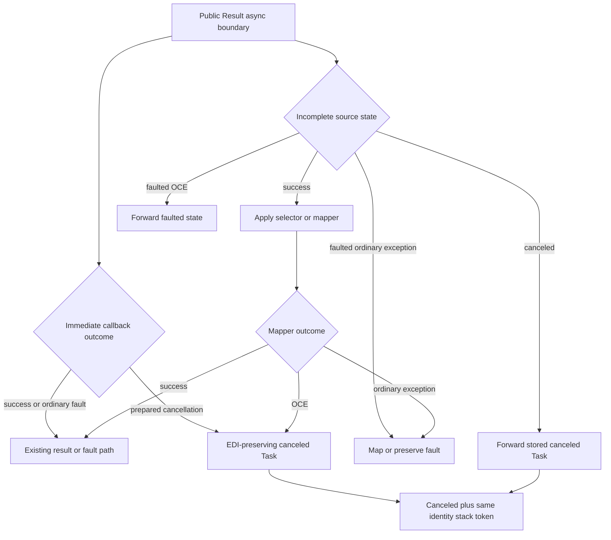
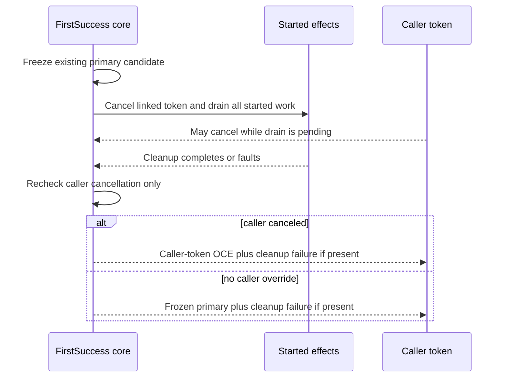
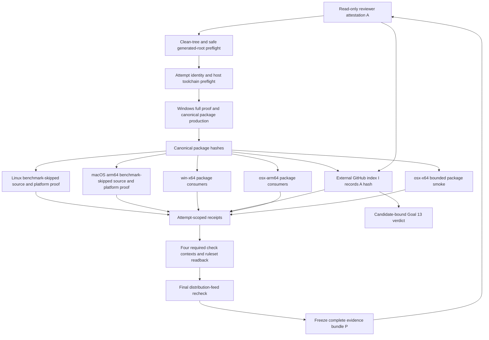
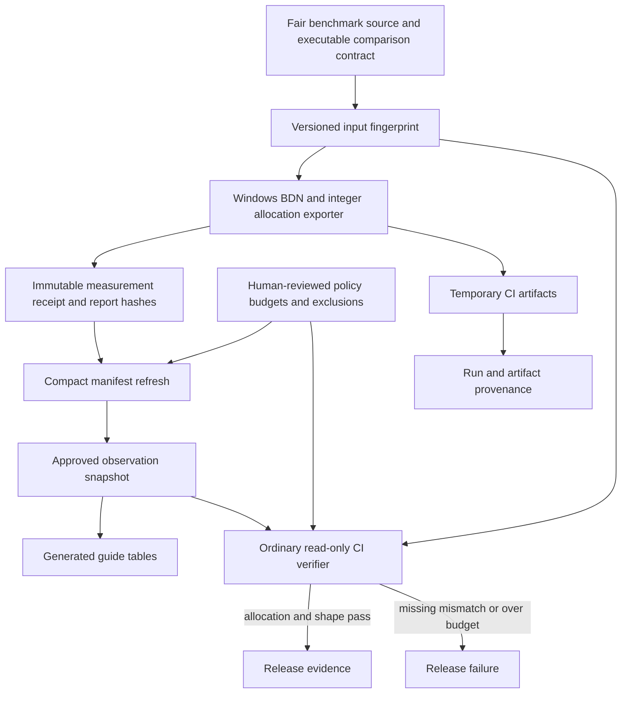

# Restore FunnySharp Release Acceptance - Plan

## Goal Capsule

- **Objective:** FunnySharp can be accepted as a release candidate only after its public cancellation behavior, documentation, performance evidence, clean release process, and required cross-platform gates all satisfy the accepted Goals 01-13 contracts.
- **Means:** Repair the two package-proven correctness defects test-first, replace invalid performance evidence with a tracked allocation contract, harden the existing release pipeline, and require Windows, Linux, and macOS evidence before publishing a corrected Goal 13 verdict (KTD1-KTD8).
- **Authority:** `docs/goals/archive/01-goal.md` through `docs/goals/archive/12-goal.md` remain the immutable product contracts. `docs/goals/archive/13-goal.md`, `docs/product-contract.md`, and `artifacts/goal13-final-review/final-review.md` define the current audit boundary and findings.
- **Execution profile:** Land the acceptance-restoring units before the second-layer hardening units. Start public-behavior changes with deterministic failing tests and treat release/CI changes as protocol changes whose runner, verifier, schema, and fixtures move together.
- **Tail ownership:** Implementation owns local validation and creation of candidate evidence. Pushes, pull requests, branch-ruleset changes, and releases remain separately authorized operations; without that authorization, the audit may be complete but product acceptance remains fail-closed.
- **Stop conditions:** Stop for a new product decision if the four-property cancellation contract cannot be preserved, a fix requires broad public API expansion outside the affected surfaces, a required RID cannot execute on a matching host, or a deletion path cannot be proven to remain inside an intended project/output directory.

---

## Product Contract

### Summary

Restore release acceptance by correcting the `Result` and `FirstSuccessAsync` cancellation defects, making release documentation fail-closed, replacing invalid performance evidence with a fair allocation contract, and requiring fresh package-consuming evidence on the supported Windows, Linux, and macOS matrix.

### Problem Frame

The September 3 final review proved that the existing all-green release pipeline can miss public semantic defects. `Result` async boundaries can destroy cancellation diagnostics, and `FirstSuccessAsync` can publish timeout after caller cancellation wins during cleanup. The tracked release documentation still reports acceptance, so the candidate fails Goals 04, 09, and 12 even though 310 tests and the canonical release command pass.

The same review found weaker but real evidence problems: several benchmark rows are not behaviorally comparable, exact guide tables are manually maintained, the release runner can reuse generated restore state, evidence is Windows-only, and different checkout paths do not currently produce byte-identical binaries. This plan separates acceptance blockers from hardening so correctness is restored first without dropping any recorded finding.

### Key Decisions

- **Address every final-review finding in two layers.** Acceptance blockers land first; non-blocking coverage, provenance, and reproducibility work follows without weakening the first release gate. (session-settled: user-approved — chosen over blocker-only remediation: the user requested every P0-P3 and residual finding to remain visible.) Governs R1-R19.
- **Cancellation preservation is exact.** Original `OperationCanceledException` identity, established stack trace, canceled operation state, and original token are all mandatory. (session-settled: user-approved — chosen over token/status-only preservation: the archived Goal 04 contract protects diagnostic evidence.) Governs R1-R3.
- **Affected public APIs may change only when that yields a smaller and clearer contract.** Compatibility is not a constraint during rapid development, but no redundant type, overload, or abstraction is acceptable. (session-settled: user-directed — chosen over compatibility-first constraints: API clarity is the governing quality bar.) Governs R1-R5, R7.
- **All three desktop/server operating systems are first-class release gates.** Windows, Linux, and macOS failures block merge and release. (session-settled: user-directed — chosen over informational secondary-platform checks: correctness support must be symmetric across supported operating systems.) Governs R13-R17.
- **Hosted CI blocks on allocation, not elapsed time.** Fair benchmark shape and allocation ceilings are required; timing is directional until a fixed self-hosted runner establishes a noise floor. (session-settled: user-approved — chosen over noisy hosted timing thresholds: allocation is the stable enforcement signal available now.) Governs R8-R12, R19.
- **Generated evidence remains outside Git by default.** Source benchmarks, scripts, compact manifests, generated guide tables, and evergreen summaries such as `docs/goals/archive/13-goal.md` and `docs/release-readiness.md` are tracked. Candidate-specific matrices and verdicts remain attempt-scoped GitHub artifacts/job summaries; packages, logs, CSV, HTML, and publish trees remain short-lived CI artifacts unless explicitly requested. (session-settled: user-directed — chosen over committing bulky evidence: the repository stays small while the evidence contract remains reproducible.) Governs R10, R15-R17.
- **Archived Goals 01-12 remain immutable.** Correct current documentation and revise Goal 13 rather than rewriting historical acceptance contracts. (session-settled: user-directed — chosen over retrospective contract edits: failures must be fixed rather than erased.) Governs R6-R7, R18.
- **`.NET 11` targeting begins only after GA.** The current repair remains `net10.0`; the future target and validation matrix are recorded but not implemented now. (session-settled: user-directed — chosen over preview targeting: preview behavior is not a supported release contract.) Governs R19.

### Requirements

**Result cancellation correctness**

- R1. Every synchronous `OperationCanceledException` entering a public Task- or ValueTask-returning Result boundary must produce a canceled operation while preserving the exact exception object, its established stack, and its token.
- R2. If an asynchronous Result error mapper throws `OperationCanceledException`, the returned operation must be canceled and preserve that exact mapper exception, stack, and token rather than replacing it with `TaskCanceledException`.
- R3. A source Task that is faulted with `OperationCanceledException` must remain faulted, while a genuinely canceled source remains canceled; ordinary faults and successful fast paths retain their existing behavior and `ValueTask` sources are consumed once.

**First-success cancellation correctness**

- R4. Both timeout-selected `FirstSuccessAsync` paths must re-evaluate caller cancellation after cleanup and publish caller-token cancellation whenever it occurred before terminal publication.
- R5. Cleanup failures must remain observable through the existing primary-plus-cleanup aggregation contract, while timeout-without-caller-cancellation, winner selection, typed failure ordering, loser draining, and winner-only loser-fault suppression remain unchanged.

**Documentation and audit truthfulness**

- R6. Current Option documentation must describe the shipped Result conversions, release-readiness material must be fail-closed and candidate-accurate, and Goal 13 must separately report audit completion and product acceptance.
- R7. `docs/goals/archive/01-goal.md` through `docs/goals/archive/12-goal.md` remain unchanged. Before candidate production, every intended distribution feed must confirm both packages have no `0.1.0`; the version remains `0.1.0` only while that precondition holds, otherwise work stops for a new explicit version decision.

**Performance evidence**

- R8. Invalid Option construction/inspection rows and the ignored supplemental Result traversal ratios must not support any claim; retained or replacement comparisons must use equivalent carriers, inputs, work, terminal behavior, and result consumption.
- R9. The tracked benchmark corpus must cover the changed pending Task/ValueTask Result completion path. The invalid supplemental Result parallel-traversal comparison remains excluded unless a later accepted claim justifies implementing equivalent source, fail-fast, cancellation, drain, ordering, and consumption semantics on both sides.
- R10. A tracked compact performance manifest must separate reviewed policy from generated observation. It identifies included and excluded scenarios, canonical benchmark-input and verifier-protocol fingerprints, comparison semantics, parameters, environment key, directional timing state, integer allocation bytes, immutable measurement provenance, and a per-row integer allocation budget pre-registered before the measurement used for acceptance.
- R11. CI must fail when a required allocation observation is absent, nonnumeric, semantically mismatched, or over its allocation ceiling; zero-allocation rows remain exactly zero. Timing is independently classified as `observed`, `below-resolution`, or `unavailable`, never blocks hosted CI, and produces no ratio when it is not comparable.
- R12. Exact guide performance tables must be generated from the tracked manifest and verified against it rather than edited manually; raw benchmark output remains a CI artifact.

**Release and compatibility evidence**

- R13. The canonical release runner must reject tracked changes or unignored untracked candidate files, remove only validated project-local generated roots, start from an empty isolated NuGet package cache, perform locked no-cache restore, and record those facts in its evidence.
- R14. Runner and verifier must consume one declarative release protocol, including benchmark and benchmark-skipped modes, while independently producing and recomputing evidence. Skipping benchmarks cannot skip build, tests, examples, pack, format, API/XML/package checks, documentation checks, or package-consuming compatibility.
- R15. One canonical package producer must publish the exact package hashes consumed on every supported RID. Package-consuming checks exercise the repaired Goal 04 and Goal 09 behavior in addition to the existing trim/AOT paths; platform-local builds remain separate source/platform evidence and cannot substitute a different package for the canonical consumer proof.
- R16. GitHub Actions must expose `release / win-x64` with the full correctness/package/performance proof, `release / linux-x64` and `release / osx-arm64` with benchmark-skipped correctness/package/trim/Native AOT proof, and `release / osx-x64-consumer` with the bounded package-consumer smoke. Every leg runs on a matching host; the Intel smoke performs an isolated local-feed restore, core and ASP.NET Core runtime probes, Goal 04/09 probes, RID assertion, and exact package/DLL hash checks. Any required failure or unavailable matching host blocks merge and release; normal merge/release actors have no bypass, and any emergency bypass invalidates that candidate's verdict.
- R17. Every release attempt has an immutable identity and records candidate commit/source fingerprint, workflow revision, event, run ID and attempt, job/RID, runner image, pinned action revisions, SDK/runtime, package/DLL/compatibility hashes, final version-state check, and ruleset proof. Provenance is a one-way DAG: immutable evidence bundle `P` assembled only after every verdict input is final; read-only reviewer attestation `A` that references only `P` and goal-contract hashes; external GitHub index/job summary `I` that records the hash of `A`. No layer modifies or back-references a later layer; any post-freeze input change starts a new attempt. Per-leg artifacts are uniquely named, uploaded on success and failure with short retention; expired bytes require a fresh candidate audit rather than a reproducibility claim.

**Second-layer hardening and future work**

- R18. Non-blocking test gaps, benchmark exclusions, historical provenance gaps, and cross-path binary differences must be converted into explicit tests, manifest exclusions, generated documentation, or a bounded diagnosis rather than left as unexplained review notes.
- R19. `TODO.md` must retain the future fixed-hardware performance runner and add the requirement to introduce `net11.0` plus the full supported-runtime gates after .NET 11 GA; neither is part of the current release blocker set.

### Acceptance Examples

- AE1. Covers R1. Given an `OperationCanceledException` whose stack already contains an origin marker, when `TryAsync` or `TryValueAsync` receives it synchronously, then awaiting the result observes the same object, the same marker, the same token, and a canceled operation.
- AE2. Covers R2. Given a non-cancellation source fault and an error mapper that throws a prepared `OperationCanceledException`, when the Task and ValueTask adapters complete, then both preserve the mapper exception object, stack, token, and canceled state.
- AE3. Covers R3. Given one canceled Task and one faulted Task carrying `OperationCanceledException`, when each crosses the shared Result transform, then the first remains canceled and the second remains faulted without replacing either exception.
- AE4. Covers R4-R5. Given timeout selection followed by a loser that holds cleanup open, when the caller cancels before cleanup completes, then both timeout branches publish caller cancellation; when cleanup also fails, the aggregate retains caller cancellation as primary and the cleanup failure as secondary.
- AE5. Covers R6-R7. Given the repaired public package, when a reader inspects Option, Result, readiness, and Goal 13 documentation, then the shipped interop is accurate, audit completion is distinct from product acceptance, and no archived Goal changed.
- AE6. Covers R8-R12. Given a performance refresh with policy fixed before the acceptance run, when benchmark inputs, protocol, or comparison semantics differ, the scenario is excluded or rejected; when integer allocation exceeds a tracked ceiling, verification fails; an unresolved timing sample remains non-blocking and renders no ratio; generated guide tables exactly match the approved observation snapshot.
- AE7. Covers R13-R15. Given a clean tracked checkout with stale `bin`, `obj`, and ambient NuGet state, when the canonical runner starts, then it safely removes only validated generated roots, uses a new isolated cache, rebuilds the candidate, and proves the package consumers against the produced hashes.
- AE8. Covers R15-R17. Given an authorized pull request, when any required Windows, Linux, macOS arm64, or macOS x64 consumer leg fails or consumes a non-canonical package hash, then the release is blocked while every attempt remains separately attributable and its available artifact remains diagnosable.
- AE9. Covers R18-R19. Given completion of the acceptance layer, when second-layer hardening runs, then every recorded residual is either directly tested, explicitly excluded with rationale, or resolved by a bounded report; future .NET 11 and self-hosted timing work remains in `TODO.md`.

### Key Flows

- F1. **Complete a Result async boundary**
  - **Trigger:** A Result adapter or combinator receives a synchronous callback outcome or an incomplete Task/ValueTask.
  - **Steps:** Classify success, ordinary fault, faulted cancellation exception, genuine cancellation, and mapper outcome; forward the chosen completed operation without losing diagnostics.
  - **Outcome:** The returned carrier has the intended state and preserves the exact failure/cancellation evidence.
  - **Covered by:** R1-R3; AE1-AE3.
- F2. **Publish a first-success terminal outcome**
  - **Trigger:** Winner, caller cancellation, timeout, typed failures, or cleanup becomes terminal while effects remain pending.
  - **Steps:** Capture the existing winner/timeout/failure primary candidate, cancel and drain the started effects, retain cleanup failure, allow only caller cancellation to override after cleanup, then publish through the existing aggregation contract.
  - **Outcome:** No work or fault is orphaned, and caller cancellation cannot be misreported as timeout.
  - **Covered by:** R4-R5; AE4.
- F3. **Produce and validate performance evidence**
  - **Trigger:** An approved benchmark corpus runs on the Windows reference CI leg.
  - **Steps:** Validate executable comparison semantics, generate integer allocation and timing-state receipts, compare them read-only with reviewed manifest policy, and generate guide tables only from an explicitly approved observation snapshot.
  - **Outcome:** Performance costs remain visible and auditable without noisy hosted timing becoming a release gate.
  - **Covered by:** R8-R12; AE6.
- F4. **Prove a release candidate across supported platforms**
  - **Trigger:** Pull request, main push, or manual release workflow.
  - **Steps:** Establish fresh generated state and isolated restore, produce one canonical package, build/test on every full host, execute that package's consumers on every required RID, upload attempt-scoped evidence, and verify the external ruleset before publishing acceptance.
  - **Outcome:** The candidate is eligible for a corrected Goal 13 audit only after every required platform proves its assigned contract.
  - **Covered by:** R13-R17; AE7-AE8.

### Scope Boundaries

**Included**

- Narrow repair or redesign of the affected Result completion and first-success terminal-selection internals.
- Deterministic regression tests in the existing xUnit v3 suites and package consumers.
- Fair tracked benchmark sources, allocation budgets, a compact manifest, verifier, and generated performance tables.
- Hardening of the existing PowerShell release authority and addition of GitHub Actions required checks.
- Documentation corrections, Goal 13 status semantics, candidate-bound final evidence, and all recorded second-layer findings.

**Deferred to Follow-Up Work**

- A fixed-hardware self-hosted throughput gate and timing regression thresholds after a measured noise floor exists.
- Actual `net11.0` targeting and .NET 11 release validation after .NET 11 GA.
- Windows ARM64 and Linux ARM64 required gates until representative consumer demand exists.
- A byte-identical package guarantee; this plan diagnoses cross-path differences and may apply low-cost normalization, but it does not make equality a release blocker.

**Outside this product's identity**

- Editing archived Goals 01-12 to weaken or reinterpret their contracts.
- Adding a custom scheduler, cancellation carrier, async Result wrapper, DI container, or large functional abstraction to solve these defects.
- Committing generated packages, raw logs, CSV/HTML reports, publish trees, or NuGet caches without a separate explicit request.
- Publishing or describing `0.1.0` as accepted while a material Goal remains failed or unverified.

### Success Criteria

- The focused Result and first-success regression suites prove the formerly failing package-bound scenarios and preserve every adjacent cancellation/fault contract.
- The local Windows canonical runner completes from validated fresh generated state and an empty isolated NuGet cache with zero warnings/errors and all tests passing.
- All required GitHub Actions checks pass on their matching RIDs, and branch protection treats each as required.
- The performance verifier rejects invalid/missing rows and allocation regressions while accepting timing variation; guide tables are reproducibly generated from the tracked manifest.
- The corrected Goal 13 audit reports `Audit status: COMPLETE` and `Product acceptance: PASS` only after Goals 01-12 all pass against the repaired package hashes.
- Every second-layer review item has a test, an explicit evidence exclusion/boundary, a diagnosis artifact, or a recorded future trigger.

### Sources

- `artifacts/goal13-final-review/final-review.md` is the findings-first final synthesis that this plan remediates.
- `artifacts/goal13-final-review/goal04-repro/receipt.json` and `artifacts/goal13-final-review/goal09-repro/evidence.json` contain package-bound deterministic counterexamples.
- `artifacts/goal13-final-review/clean-clone/artifacts/goal01-clean-checkout-evidence/evidence.json` proves the candidate can restore/build/test/pack from a clean clone.
- `artifacts/goal13-final-review/reproducibility-comparison.json` records the current cross-path DLL/MVID/package differences.
- [.NET `ExceptionDispatchInfo`](https://learn.microsoft.com/en-us/dotnet/api/system.runtime.exceptionservices.exceptiondispatchinfo?view=net-10.0) and [`TaskCompletionSource<T>.TrySetFromTask`](https://learn.microsoft.com/en-us/dotnet/api/system.threading.tasks.taskcompletionsource-1.trysetfromtask?view=net-10.0) constrain the Result repair.
- [GitHub-hosted runners](https://docs.github.com/en/actions/reference/runners/github-hosted-runners), [workflow syntax](https://docs.github.com/en/actions/reference/workflows-and-actions/workflow-syntax), and [artifact guidance](https://docs.github.com/en/actions/tutorials/store-and-share-data) constrain the CI design.
- [BenchmarkDotNet good practices](https://benchmarkdotnet.org/articles/guides/good-practices.html) and [MemoryDiagnoser](https://github.com/dotnet/BenchmarkDotNet/blob/master/src/BenchmarkDotNet/Diagnosers/MemoryDiagnoser.cs) constrain hosted performance claims.

---

## Planning Contract

### Key Technical Decisions

- KTD1. **Create cancellation once, then forward that exact completed state.** An internal async helper throws the prepared OCE through `ExceptionDispatchInfo`, producing the proven identity/stack/token-preserving canceled Task; existing continuations transfer that Task with .NET 10 `TrySetFromTask`. Faulted-source OCE remains faulted through `Task.FromException`/fault completion, genuine cancellation and callback OCE use the canceled Task, and completed success keeps its current fast path. (session-settled: user-approved — chosen over token-only `TrySetCanceled` or public API expansion: all four cancellation properties are mandatory.) Governs R1-R3.
- KTD2. **Freeze the primary first-success candidate before cleanup.** Preserve the existing winner/timeout/typed-failure choice, drain started work, and allow only caller cancellation to override at one post-drain point before `CreatePrimaryFailure` combines any cleanup failure. Do not introduce a general terminal-state framework. (session-settled: user-approved — chosen over patching only the reproduced branch: duplicated precedence logic caused the defect.) Governs R4-R5.
- KTD3. **Keep only fair, consumed benchmark comparisons.** Remove invalid Option construction rows, keep the ignored Result traversal experiment excluded, and add a genuinely pending Result-transform scenario that exercises KTD1 with equivalent completion control and result consumption. (session-settled: user-approved — chosen over retaining caveated but non-diagnostic ratios: performance evidence must measure equivalent work.) Governs R8-R9.
- KTD4. **Make allocation the hosted performance contract without letting measurements approve policy.** Keep one compact manifest with separately owned policy and observation sections: source tooling may refresh provenance and measured values, but cannot raise budgets or add exclusions. Allocation uses integer bytes and blocks; timing has an explicit non-blocking state and generates a ratio only when comparable. (session-settled: user-approved — chosen over hosted timing thresholds and hand-edited tables: allocation is enforceable while shared-runner timing is not.) Governs R10-R12.
- KTD5. **Extend the existing release authority around a declarative protocol.** Runner and verifier consume the same data-only step/schema definition, but the verifier independently recomputes paths, hashes, step completeness, and evidence invariants. Fresh-state cleanup, isolated restore, and full/benchmark-skipped modes remain in the existing scripts. (session-settled: user-approved — chosen over nested local clone/worktree orchestration or shared executable validation logic: CI supplies the fresh checkout and independent verification avoids common-mode acceptance.) Governs R13-R15.
- KTD6. **Use one canonical package across host-matched required gates.** The Windows full leg produces the canonical packages; `win-x64`, `linux-x64`, `osx-arm64`, and Intel `osx-x64` consumers verify and execute those exact hashes. Linux and macOS arm64 also perform full source/platform release proof; Intel macOS performs the bounded smoke in R16. (session-settled: user-directed — chosen over optional or per-host-only package checks: Windows, Linux, and macOS are first-class and the accepted package must be unambiguous.) Governs R15-R17.
- KTD7. **Bind temporary evidence externally without claiming it can be reconstructed.** Track policy, schemas, manifests, scripts, and evergreen acceptance rules; upload attempt-scoped bulky evidence under unique names and record its digest/run identity in GitHub provenance rather than inside the artifact it hashes. After retention expiry, a new audit is required for byte-level reinspection. (session-settled: user-directed — chosen over committing generated evidence: bulky artifacts may be dropped unless explicitly requested.) Governs R10, R15-R17.
- KTD8. **Treat byte reproducibility and exhaustive coverage as bounded hardening.** Diagnose path-dependent build inputs and close concrete P3 tests, but do not add redundant public APIs or turn unclaimed timing/platform breadth into acceptance requirements. (session-settled: user-approved — chosen over immediate bit-identical release gating: the current contracts require repeatable behavior and exact evidence binding.) Governs R18-R19.

### High-Level Technical Design

**Result completion state model**



**First-success terminal publication**



**Release and CI evidence flow**



**Performance evidence lifecycle**



### Output Structure

```text
.github/
  workflows/
    release.yml
benchmarks/
  FunnySharp.Benchmarks/
    AllocationReceiptExporter.cs
    StateMachineBenchmarks.cs
eng/
  Compare-ReproducibleBuilds.ps1
  release-protocol.json
  Verify-Performance.ps1
  Generate-PerformanceDocumentation.ps1
  performance/
    baseline.json
  tests/
    PerformanceProtocol.Tests.ps1
    ReleaseProtocol.Tests.ps1
docs/
  plans/
    2026-09-03-2223-fix-release-acceptance-plan.md
TODO.md
```

Existing source, test, benchmark, documentation, and release files remain the primary modification surface; the tree shows only the material new structure.

### System-Wide Impact

- **Library consumers:** Receive corrected cancellation classification and diagnostics without new runtime dependencies; any intentional public API adjustment is limited to the affected surfaces and must reduce ambiguity.
- **Maintainers:** Gain deterministic race regressions, explicit performance exclusions/budgets, and a release runner that cannot silently reuse local generated state.
- **Reviewers:** Can trace every exact performance table and acceptance verdict to tracked inputs plus candidate-specific CI provenance.
- **Release operators:** Must wait for stable Windows, Linux, macOS arm64, and macOS x64 consumer checks before accepting `0.1.0`.
- **Future platform work:** Gets explicit .NET 11 GA and self-hosted timing triggers without pulling preview or infrastructure work into this repair.

### Risks and Dependencies

| Risk or dependency | Impact | Mitigation |
| --- | --- | --- |
| Async refactoring converts a faulted OCE into cancellation | Breaks an existing Result boundary while fixing another | Preserve explicit source-state classification and assert both state and exception identity in U1 |
| Token-only Task completion reappears | Loses mapper cancellation identity/stack | Centralize cancellation forwarding under KTD1 and prohibit `TrySetCanceled(token)` on identity-preserving paths |
| Only one timeout branch is repaired | Leaves a deterministic Goal 09 race | Map tests to both timeout-selected branches and centralize post-drain publication in U2 |
| Performance policy and observations self-approve | Lets one refresh silently raise a ceiling or add an exclusion | Keep separate policy/observation ownership, pre-register policy before the acceptance run, and require a new run after any policy change |
| Benchmark input or verifier protocol drifts | Applies stale observations to a different executable contract | Hash the versioned source/build-input closure and verifier/exporter protocol separately; incompatible fingerprints require a reviewed refresh |
| Benchmark comparer performs different work | Produces persuasive but invalid ratios | Execute a comparison preflight that checks calls, terminal index, cancellation/drain, output checksum, and consumption before inclusion |
| Generated-root cleanup escapes a project | Can delete user data | Enumerate tracked project parents, resolve every target, reject reparse points, and test refusal paths before deletion |
| Runner and verifier schemas drift or share a common implementation bug | Produces false failure or incomplete green evidence | Consume a shared data-only protocol, then have the verifier independently recompute paths, hashes, steps, and mode completeness |
| Cross-platform MSBuild paths remain Windows-specific | Breaks Linux/macOS release legs | Normalize separators and validate every generated path within its scenario root |
| Different hosts build different package bytes | Makes a cross-platform verdict ambiguous | Designate the Windows full leg as canonical producer and require every RID consumer to verify those exact package and DLL hashes |
| Intel macOS capacity, runner labels, or Native AOT prerequisites change | Removes real matching-host execution proof | Pin reviewed labels/actions, preflight RID/SDK/toolchain, emit `blocked-infrastructure`, and prohibit cross-publish substitution |
| Release retry overwrites a failed attempt | Breaks provenance and hides intermittent failure | Use a new immutable `<commit>/<attempt-id>` output root, preserve failed receipts, and accept retries only for the same commit/fingerprint |
| Required-check ruleset drifts or is bypassed | A green workflow no longer guarantees merge/release blocking | Read back ruleset ID/revision/check contexts/bypass set; normal actors have no bypass and emergency use invalidates the candidate |
| Evidence producer certifies its own output | Repeats the original all-green-but-wrong acceptance failure | Finalize CI, ruleset, and version receipts; freeze them as `P`; then require a named independent read-only Goal 01-13 reviewer |
| Reviewer attestation mutates or hashes itself | Reintroduces the same provenance cycle under a different filename | Enforce the one-way `P -> A -> I` graph; each layer is immutable and only the next layer hashes it |
| Package version already exists on a target feed | Consumer resolution or publication may bind different bytes to `0.1.0` | Query all intended distribution feeds before candidate production and stop for a new version decision on any match |
| Hosted benchmark timing is noisy or below resolution | Creates false regressions or meaningless ratios | Block only on comparison shape and integer allocation; classify timing independently and render `N/A` when it is not comparable |
| CI artifacts expire | Removes the bytes needed for later reinspection | Track schemas, hashes, and run identity; complete the audit during retention and require a fresh candidate run for later byte-level reinspection |
| Cross-path binaries remain non-identical | Prevents hash interchange between runs | Keep evidence bound to exact artifacts and run the bounded U10 diagnosis without making byte equality a release gate |

### Alternatives Considered

- **Add new public cancellation wrapper types.** Rejected because .NET 10 primitives can satisfy the exact contract internally and a new abstraction would enlarge the API without adding user value.
- **Patch each timeout branch independently.** Rejected because duplicated precedence logic caused the current inconsistency and would remain easy to regress.
- **Keep invalid benchmark rows with stronger caveats.** Rejected because a caveat cannot turn non-equivalent work into diagnostic evidence.
- **Use hosted timing thresholds.** Rejected until a fixed runner supplies a measured noise floor; allocation budgets provide the enforceable signal now.
- **Create a second CI-only release implementation.** Rejected because it would drift from the existing local authority; GitHub Actions should invoke the same runner/verifier protocol.
- **Commit raw packages and reports.** Rejected by the evidence policy; tracked schemas/manifests plus attempt-scoped GitHub provenance preserve the contract without repository bloat.
- **Make bit-identical packages a blocker now.** Rejected because the accepted Goals require repeatable behavior and evidence, while checkout path, PDB, MVID, and archive normalization still require diagnosis.

### Phased Delivery

**Layer 1: Restore product acceptance**

- U1-U2 repair the package-proven correctness failures.
- U3 repairs the benchmark corpus and U4 establishes the standalone allocation/documentation contract.
- U5 integrates both into the fresh-state declarative release protocol.
- U6-U7 add required platform gates and correct the current product/audit documentation.
- The layer ends with all material blockers locally ready for the final candidate audit; it does not publish product PASS yet.

**Layer 2: Close residual findings**

- U9 adds the remaining focused regressions and makes intentionally unmeasured performance areas explicit.
- U10 diagnoses cross-path reproducibility and preserves the future .NET 11/self-hosted-runner triggers.
- U8 runs last and publishes a candidate-bound acceptance result only after all tracked changes plus separately authorized CI and ruleset proof succeed.

---

## Implementation Units

U-IDs remain stable references; execution order is `U1, U2, U3, U4, U5, U6, U7, U9, U10, U8` so the final candidate audit runs after both remediation layers.

### U1. Preserve Result cancellation diagnostics

- **Goal:** Repair every shared Task/ValueTask Result completion path so cancellation preserves the exact exception, stack, token, and canceled state without reclassifying faulted OCE sources.
- **Requirements:** R1-R3; AE1-AE3; KTD1.
- **Dependencies:** None.
- **Files:**
  - `src/FunnySharp/Result.cs`
  - `src/FunnySharp/ResultExtensions.cs`
  - `tests/FunnySharp.Tests/ResultBoundaryTests.cs`
  - `tests/FunnySharp.Tests/ResultAsyncTests.cs`
- **Approach:**
  1. Add the complete failing state/identity/stack matrix before changing completion plumbing.
  2. Create one narrowly named internal async helper that throws a prepared OCE through `ExceptionDispatchInfo` and returns its identity-preserving canceled Task.
  3. Transfer that already-completed state with `TrySetFromTask` only where the existing continuation requires a completion source; never reconstruct identity-preserving cancellation from a token.
  4. Keep genuine source cancellation, faulted source OCE, mapper cancellation, ordinary fault, and successful projection as distinct internal states; faulted-source OCE remains faulted.
  5. Reuse the corrected Task-backed path from incomplete ValueTask operations, keep custom ValueTask sources single-consumption, and retain completed-success fast paths.
- **Execution note:** Implement test-first from the persisted Goal 04 package repro and delete no public surface merely to make the tests convenient.
- **Patterns to follow:** `src/FunnySharp/Effect.cs` and the existing `ExceptionDispatchInfo` paths in the concurrency implementations preserve exception evidence without custom carriers.
- **Test scenarios:**
  - Covers AE1. A prepared OCE thrown synchronously into `TryAsync` returns a canceled Task and preserves exact reference, token, and original stack marker.
  - Covers AE1. The equivalent `TryValueAsync` path preserves all four properties.
  - Covers AE2. Task and ValueTask error mappers that throw a prepared OCE preserve the mapper exception and canceled state.
  - Covers AE3. A genuinely canceled source remains canceled and retains its source cancellation evidence.
  - Covers AE3. A faulted Task containing OCE remains faulted and preserves the same exception rather than becoming canceled.
  - Ordinary mapper failure remains faulted with the same exception.
  - Completed success remains synchronous where currently promised and does not introduce an avoidable Task wrapper.
  - Pending and custom ValueTask sources are consumed exactly once.
  - `MapAsync`, `BindAsync`, `MapValueAsync`, and `BindValueAsync` inherit the repaired behavior through the shared boundary.
- **Verification:** The focused boundary and async Result suites pass; the four persisted repro scenarios now report the intended state/identity/stack/token; public API inventory changes only when an explicit design review proves a smaller surface.

### U2. Centralize FirstSuccess post-drain precedence

- **Goal:** Ensure caller cancellation wins after any timeout-selected cleanup without losing cleanup failures or changing other first-success semantics.
- **Requirements:** R4-R5; AE4; KTD2.
- **Dependencies:** None.
- **Files:**
  - `src/FunnySharp/ConcurrentEffectExtensions.cs`
  - `tests/FunnySharp.Tests/FirstSuccessTests.cs`
  - `docs/concurrency.md`
- **Approach:**
  1. Recreate the package repro twice inside the deterministic xUnit fixture, once for each timeout-selected branch.
  2. Capture the existing winner, timeout, or no-success primary candidate before cleanup begins.
  3. Route post-drain publication through one narrow helper that permits only caller cancellation to replace that frozen primary candidate.
  4. Combine the resulting primary with cleanup failure through the existing `CreatePrimaryFailure` contract.
  5. Keep cold effect admission, input-order tie-breaking, typed failure accumulation, timeout cancellation, winner selection, and loser-fault observation unchanged.
- **Execution note:** Use `ManualTimeProvider`, explicit task gates, and `RunContinuationsAsynchronously`; no wall-clock sleeps or probabilistic races.
- **Patterns to follow:** The winner and signal-wait branches already recheck caller cancellation after cleanup; existing `CreatePrimaryFailure` owns primary-plus-cleanup aggregation.
- **Test scenarios:**
  - Covers AE4. Timeout and winner are observed together, cleanup is held open, caller cancels, and the final exception is caller-token OCE.
  - Covers AE4. Timeout is selected without a winner, cleanup is held open, caller cancels, and the final exception is caller-token OCE.
  - The same two interleavings with a cleanup fault retain both caller cancellation and cleanup failure in the established order.
  - Timeout remains `TimeoutException` when the caller never cancels.
  - A completed winner remains successful when neither caller cancellation nor cleanup failure occurs.
  - Caller cancellation observed before timeout retains its existing behavior.
  - Loser faults after a winner remain observed and suppressed only under the documented winner rule.
- **Verification:** Both deterministic package repros become negative controls, every existing first-success test remains green, and source review shows no timeout publication that bypasses the post-drain caller check.

### U3. Repair the benchmark corpus

- **Goal:** Remove non-diagnostic measurements and add only the fair scenarios needed to observe the repaired hot paths.
- **Requirements:** R8-R9; AE6; KTD3.
- **Dependencies:** U1, U2.
- **Files:**
  - `benchmarks/FunnySharp.Benchmarks/OptionBenchmarks.cs`
  - `benchmarks/FunnySharp.Benchmarks/ResultBenchmarks.cs`
  - `benchmarks/FunnySharp.Benchmarks/Program.cs`
- **Approach:**
  1. Remove the three invalid Option construction/inspection categories; do not replace them unless a future accepted claim requires a separately reviewed equivalent design.
  2. Keep the ignored Result parallel-traversal experiment excluded with its fairness rationale; do not build a duplicate direct fail-fast coordinator for this release.
  3. Add pending Task and ValueTask Result transforms using fresh deterministic incomplete sources, identical source-creation/completion boundaries, and `RunContinuationsAsynchronously`.
  4. Assert the source is incomplete when each transform is invoked, consume each ValueTask exactly once, and validate/consume the final logical result on both sides.
  5. Give each comparison group an executable semantic preflight for callback counts, terminal index, cancellation/drain behavior, ordered output checksum, and result consumption before BenchmarkDotNet runs.
- **Execution note:** Treat semantic equivalence review as a prerequisite to measurement; a successfully completed BenchmarkDotNet process is not evidence by itself.
- **Patterns to follow:** The tracked Option/Validation traversal comparisons already share a source carrier and selector; direct baselines throughout the benchmark project make setup state explicit in global setup.
- **Test scenarios:**
  - Source-manifest validation rejects a category whose baseline or FunnySharp method is missing.
  - A benchmark pair with different carrier identity is excluded with a reason rather than accepted.
  - Pending Result Task and ValueTask sources are incomplete at transform entry, then complete the same logical result as their direct baselines without double consumption.
  - A semantic preflight mismatch rejects the comparison before measurement.
  - Result parallel traversal remains absent from numeric claims and carries its explicit exclusion rationale.
  - Removed Option construction rows no longer appear in generated reports or documentation.
- **Verification:** Every retained category has one fair baseline, complete parameter pairs, consumed results, and explicit inclusion/exclusion status; no ignored benchmark harness contributes to the release verdict.

### U4. Establish the performance manifest and allocation gate

- **Goal:** Make performance evidence source-bound, allocation-enforced, and documentation-generated without treating hosted timing as deterministic.
- **Requirements:** R10-R12; AE6; KTD4, KTD7.
- **Dependencies:** U3.
- **Files:**
  - `benchmarks/FunnySharp.Benchmarks/AllocationReceiptExporter.cs`
  - `eng/performance/baseline.json`
  - `eng/Verify-Performance.ps1`
  - `eng/Generate-PerformanceDocumentation.ps1`
  - `eng/tests/PerformanceProtocol.Tests.ps1`
  - `docs/function-composition.md`
  - `docs/option.md`
  - `docs/result.md`
  - `docs/validation.md`
  - `docs/data-pipelines.md`
  - `docs/effects.md`
  - `docs/concurrency.md`
  - `docs/immutable-updates.md`
- **Approach:**
  1. Define one schema-versioned compact manifest with separately owned `policy` and `observation` data. Row identity includes class, category, method, parameters, carrier, completion path, expected result, comparison-group contract, and inclusion state.
  2. Bootstrap each exact-zero invariant, nonzero integer-byte ceiling, and exclusion from existing candidate evidence or an equivalent direct baseline plus explicit headroom rationale, and commit that policy before the measurement used for acceptance. No generator may raise a budget or add an exclusion.
  3. Define a versioned canonical benchmark-input fingerprint over relevant product/benchmark sources, project and lock files, and global build inputs while excluding `eng/performance/baseline.json` and generated docs. Record a separate protocol hash for the verifier/exporter and an environment key for OS/architecture, SDK/runtime, JIT, and GC.
  4. Produce an immutable measurement receipt with commit, run provenance, report hashes, timing state, and integer `allocatedBytesPerOperation` from an unformatted BenchmarkDotNet data path; fail if only rounded display text is available.
  5. Keep timing state independent from allocation: `observed` may generate a directional ratio, while `below-resolution` and `unavailable` generate `N/A` and never fail hosted CI.
  6. Generate exact guide tables from an explicitly approved observation snapshot under stable generated regions; ordinary CI runs verifier and documentation checks read-only and leaves the manifest/docs byte-for-byte unchanged.
  7. Make baseline refresh an explicit reviewed flow: a measurement run emits a proposed observation update, then a human reviews provenance before committing the manifest and generated docs. Any policy change lands separately and forces a new measurement; the observed run that motivated a policy change cannot also pass under that change.
- **Execution note:** Start with verifier fixtures for missing rows, malformed or formatted-only allocation values, zero-allocation regression, nonzero ceiling regression, timing below resolution, excluded rows, input/protocol/environment drift, and attempted policy mutation.
- **Patterns to follow:** `eng/Verify-Release.ps1` already validates report hashes and category/baseline presence; extend the evidence protocol rather than parsing prose logs.
- **Test scenarios:**
  - A required zero-allocation row reports nonzero bytes and fails.
  - A nonzero row at or below its ceiling passes; one byte above fails.
  - A new or removed included row fails until the manifest changes intentionally.
  - A category/baseline/method/parameter mismatch fails even when row counts remain unchanged.
  - Missing, nonnumeric, rounded-only, or non-integer allocation data fails rather than becoming zero.
  - Timing changes with unchanged allocation do not fail hosted CI; below-resolution or unavailable timing renders `N/A` rather than a ratio.
  - An excluded scenario is absent from claims and carries a nonempty reason.
  - Generated guide tables reproduce the manifest exactly and verify-only mode detects manual edits.
  - A generator attempt to raise a budget or add an exclusion fails; an explicit reviewed policy edit remains visible as a separate diff.
  - A policy edit made after observing a run cannot bless that run; acceptance requires a new measurement with the policy already fixed.
  - A historical measurement remains valid only when the policy is byte-for-byte unchanged, the observation/generated docs change without changing inputs, and the benchmark-input and protocol fingerprints remain equal; any policy or incompatible environment change requires a new measurement.
- **Verification:** Fixed 126-row/52-category assertions are removed, performance-protocol fixtures pass, actual integer allocation receipts satisfy reviewed budgets, ordinary CI writes no tracked file, and every tracked exact table is generator-owned.

### U5. Make the release runner fresh-state and protocol-driven

- **Goal:** Prevent warm restore state, unsafe cleanup, or runner/verifier drift from producing an authoritative green release.
- **Requirements:** R13-R15; AE7; KTD5.
- **Dependencies:** U1-U4.
- **Files:**
  - `eng/release-protocol.json`
  - `eng/Run-Release.ps1`
  - `eng/Verify-Release.ps1`
  - `eng/tests/ReleaseProtocol.Tests.ps1`
  - `tests/FunnySharp.Compatibility/Run-Compatibility.ps1`
  - `tests/FunnySharp.Compatibility/FunnySharp.Compatibility.Core/Program.cs`
  - `tests/FunnySharp.Compatibility/FunnySharp.Compatibility.AspNetCore/Program.cs`
- **Approach:**
  1. Before any output mutation, reject tracked changes or unignored untracked candidate files while allowing ignored project-local `bin`/`obj` roots that the following safety checks may remove; resolve commit/source fingerprint, mode, host RID/architecture, SDK/runtime, and required Native AOT toolchain into an immutable attempt identity.
  2. Allocate a never-reused `<commit>/<attempt-id>` output root and reject an existing directory. Preserve failed attempt receipts; cleanup is a separate explicit operation and cannot overwrite prior evidence.
  3. Query NuGet.org and every configured private distribution feed for both `0.1.0` package IDs, persist the exact response/time/feed set, and stop as `blocked-version-state` on any existing package, inaccessible feed, or ambiguous result before cleanup, build, pack, or consumer execution.
  4. Derive project roots from tracked project files, resolve only their direct `bin` and `obj` children, reject reparse points/escapes, and delete no path that fails validation.
  5. Create an output-local initially empty NuGet cache, set it for solution and consumer restores, use locked no-cache restore, and record cache/generation facts in execution evidence.
  6. Define canonical steps, modes, required receipts, and schema versions in `eng/release-protocol.json`. The runner produces against it; the verifier independently recomputes hashes, path bounds, step completeness, and full/skip invariants.
  7. Make `eng/tests/ReleaseProtocol.Tests.ps1` an independent oracle for mandatory full/skip steps and deletion boundaries; it must not derive its expected set from the protocol file under test.
  8. Integrate U4's read-only performance verifier into full mode. Benchmark-skipped mode omits only measurement and performance-receipt checks.
  9. Make generated MSBuild paths platform-portable, retain host-RID equality, and emit a `blocked-infrastructure` receipt rather than substituting cross-publish when the host toolchain is unavailable.
  10. Extend package consumers with compact Goal 04/09 regressions bound to the produced package, without duplicating the full xUnit suites.
- **Execution note:** This unit handles deletion and package execution; require fixture proof for every safety rejection before running it against the repository.
- **Patterns to follow:** Existing artifact-subdirectory and reparse-point guards in both release scripts, plus the isolated local-feed cache in `tests/FunnySharp.Compatibility/Run-Compatibility.ps1`.
- **Test scenarios:**
  - Covers AE7. A dirty candidate fails before deleting outputs or creating a release receipt.
  - A repeated attempt ID or pre-existing output root is rejected; a retry receives a new identity and leaves the failed receipt intact.
  - Existing `0.1.0`, an inaccessible intended feed, or an ambiguous version response produces `blocked-version-state` before cleanup or package production.
  - A project-local direct `bin`/`obj` path is removed; a sibling, ancestor, drive root, computed escape, or reparse point is rejected.
  - The restore cache is absent before the run, created under the output root, and recorded in evidence.
  - Locked restore generates fresh assets instead of reporting stale up-to-date state.
  - Full mode requires the benchmark receipt, reports, allocation verifier, and generated-table verification.
  - Skip mode omits only benchmark-specific commands/checks and still requires all correctness/package/compatibility evidence.
  - Runner/verifier disagreement with the declarative step set or schema fails even when the producer receipt claims success.
  - Removing a mandatory step from `eng/release-protocol.json` fails the independent fixture oracle rather than changing the expected result.
  - A missing SDK, RID mismatch, or missing Native AOT prerequisite produces `blocked-infrastructure` before build/package execution.
  - Windows, Linux, and macOS path separators produce output/intermediate paths within each scenario root.
  - Package consumers load the exact produced DLL and prove the repaired Result and FirstSuccess behavior.
  - Tampered package, source fingerprint, command receipt, or mode metadata fails verification.
- **Verification:** Fresh-state, version-state, attempt-lifecycle, and independent protocol fixtures pass; a clean local full run records new restore assets and an isolated cache; independent full/skip verification rejects incomplete, overwritten, or mismatched evidence.

### U6. Add required multi-OS GitHub Actions gates

- **Goal:** Make Windows full proof, Linux/macOS arm64 benchmark-skipped correctness/package/trim/Native AOT proof, and bounded Intel macOS package smoke mandatory before merge or release.
- **Requirements:** R16-R17; AE8; KTD6-KTD7.
- **Dependencies:** U5.
- **Files:**
  - `.github/workflows/release.yml`
  - `eng/Run-Release.ps1`
  - `eng/Verify-Release.ps1`
  - `tests/FunnySharp.Compatibility/Run-Compatibility.ps1`
  - `README.md`
- **Approach:**
  1. Add pull-request, protected-main push, and manual triggers with read-only contents permission, per-ref cancellation, stable required contexts `release / win-x64`, `release / linux-x64`, `release / osx-arm64`, and `release / osx-x64-consumer`, and no `pull_request_target` execution.
  2. Make the `win-x64` full leg the canonical package producer. It runs BenchmarkDotNet/allocation verification, uploads the package set once, and records its exact package/DLL hashes.
  3. After canonical package production, run `linux-x64` and `osx-arm64` full source/platform proof in parallel with benchmark-skipped mode; each leg also downloads and executes the canonical package rather than substituting its locally built package for consumer proof.
  4. Run the Intel macOS `osx-x64` smoke against the same package hashes with a fresh local-feed restore, RID assertion, core and ASP.NET Core runtime probes, and Goal 04/09 package regressions. It does not claim full benchmark or Native AOT coverage.
  5. Pin official actions to reviewed commit SHAs with comments naming their upstream release; resolve SDK through `global.json`, disable authoritative NuGet caching, and preflight the host RID/architecture plus Native AOT prerequisites before mutation.
  6. Record attempt/run/job/RID/runner/action/toolchain/package provenance, upload unique per-leg evidence on success and failure with short retention, exclude package caches, and expose the binding in the job summary.
  7. Under separate GitHub authorization, snapshot the existing `main` ruleset, configure the four exact stable check contexts with no bypass for normal merge/release actors, read the ruleset ID/revision and bypass set back through GitHub, and prove with a new test pull request that each failing context blocks merge. Restore the snapshot if activation or verification fails; any later emergency bypass invalidates the candidate verdict and requires a fresh audit.
- **Execution note:** Workflow code may land without control-plane authorization, but product acceptance cannot pass until the ruleset readback and blocking test succeed. Runner image/toolchain unavailability is `blocked-infrastructure`, not a cross-publish success.
- **Patterns to follow:** Every job invokes the same U5 release/compatibility authority; it does not reimplement command sequencing in YAML.
- **Test scenarios:**
  - Covers AE8. Each matrix job reports the intended RID and fails on a mismatch.
  - Windows completes the full benchmark/allocation path.
  - Linux x64 and macOS arm64 complete the same correctness/local-package/trim/AOT proof with benchmark skip only, then consume the canonical Windows-produced package hashes.
  - Intel macOS downloads the canonical packages, verifies package and loaded-DLL hashes, performs fresh restore plus the bounded core/ASP.NET and Goal 04/09 runtime probes, and reports `osx-x64`.
  - Matrix `fail-fast` is disabled, but no job is allowed to continue on error.
  - Artifact names cannot collide, missing upload paths fail, and the NuGet cache is never uploaded.
  - Fork pull requests receive no write token or protected secret exposure.
  - A changed or missing canonical package hash fails every consumer leg; no locally rebuilt package can satisfy that proof.
  - Ruleset readback names the exact four contexts and a deliberately failing test pull request cannot merge; failed activation restores the recorded prior ruleset.
  - Normal merge/release actors have no bypass; exercising any retained emergency bypass marks the current attempt invalid.
- **Verification:** All four stable job names complete successfully on the same candidate attempt, each consumer reports the canonical hashes, and the authorized repository-rules readback proves every context required before the release verdict is refreshed.

### U7. Correct product, release, and audit documentation

- **Goal:** Make current documentation describe the repaired API, actual support matrix, evidence lifecycle, and fail-closed audit semantics.
- **Requirements:** R6-R7, R12, R16-R17; AE5; KTD4, KTD6-KTD7.
- **Dependencies:** U1-U6.
- **Files:**
  - `docs/option.md`
  - `docs/result.md`
  - `docs/concurrency.md`
  - `docs/product-contract.md`
  - `docs/release-readiness.md`
  - `docs/release-evidence/goal-12.md`
  - `docs/goals/archive/13-goal.md`
  - `README.md`
  - `examples/FunnySharp.DocumentationSamples/VerifyDocumentationSnippets.ps1`
- **Approach:**
  1. Replace the stale Option boundary sentence with the actual Result interop and link its owning guide.
  2. Document the exact repaired Result and first-success semantics without claiming broader exception or timing guarantees.
  3. Convert release readiness into an evergreen required-gate checklist and label Goal 12's existing tracked evidence as historical pre-merge context rather than current acceptance.
  4. Update the product support/evidence policy for Windows x64, Linux x64, macOS arm64, and the macOS x64 consumer smoke while retaining `net10.0` and the existing AOT limitations.
  5. Retain and verify the revised Goal 13 contract so audit completion and product acceptance are independent statuses and every material failure or unverified criterion closes product acceptance.
  6. Replace handwritten performance tables with U4-generated regions and document temporary CI artifact retention/provenance.
- **Execution note:** Do not edit any file under `docs/goals/archive/`; verify the archive tree hash before and after the unit.
- **Patterns to follow:** `docs/product-contract.md` owns durable product boundaries; detailed feature guides own semantic behavior; candidate-specific facts belong in attempt-scoped CI evidence and GitHub provenance, not the evergreen checklist.
- **Test scenarios:**
  - Covers AE5. Option and Result guides agree that both conversion directions ship.
  - Goal 13 permits a complete audit to report product FAIL and prohibits product PASS on failed/unverified criteria.
  - Release readiness contains no fixed branch/base candidate masquerading as the current release.
  - The support matrix matches the required CI jobs and does not claim .NET 11 Preview support.
  - All C# snippets still match compiled source regions.
  - Generated performance regions verify without manual drift.
  - Archived Goal file hashes are unchanged.
- **Verification:** Documentation verification passes, links resolve within the repository, generated sections are current, and a reviewer can distinguish historical Goal 12 evidence from the next candidate's acceptance record.

### U9. Close non-blocking coverage and provenance findings

- **Goal:** Convert the remaining P3 and advisory findings into focused tests, explicit manifest exclusions, or accurate documented limits without expanding the public API casually.
- **Requirements:** R18; AE9; KTD8.
- **Dependencies:** U7.
- **Files:**
  - `tests/FunnySharp.Tests/AsyncFunctionCompositionTests.cs`
  - `tests/FunnySharp.Tests/OptionTests.cs`
  - `tests/FunnySharp.Tests/OptionInteropTests.cs`
  - `tests/FunnySharp.Tests/AsyncCollectionTraversalTests.cs`
  - `tests/FunnySharp.Tests/EffectResourceTests.cs`
  - `tests/FunnySharp.Tests/StateTransitionTests.cs`
  - `benchmarks/FunnySharp.Benchmarks/StateMachineBenchmarks.cs`
  - `eng/performance/baseline.json`
  - `docs/function-composition.md`
  - `docs/option.md`
  - `docs/validation.md`
  - `docs/data-pipelines.md`
  - `docs/state-machines.md`
  - `docs/effects.md`
  - `docs/concurrency.md`
  - `docs/immutable-updates.md`
  - `docs/aspnet-core.md`
**Finding trace**

| Source finding | Planned disposition | Completion assertion |
| --- | --- | --- |
| `artifacts/goal13-final-review/goal-02.md` async associativity residual | Focused law regression | Value, ordering, fault, and cancellation remain associative for the shipped async composition surface |
| `artifacts/goal13-final-review/goal-03.md` Option operation-edge P3 | Focused branch tests | Both `Match` forms, default/nested `Zip`, and lazy fallback selection/exception identity are pinned without an overload matrix |
| `artifacts/goal13-final-review/goal-05.md` faulted `TraverseValueAsync` P3 | Focused fault/disposal regression | Each selector carrier faults once, preserves identity, consumes once, and disposes its source |
| `artifacts/goal13-final-review/goal-07.md` repeated-`Then` low risk | Bounded characterization | Representative chain lengths quantify growth; no public API follows without repeatable hot-path evidence and separate API-design review |
| `artifacts/goal13-final-review/goal-08.md` disposal coverage residual | Focused precedence cases | Synchronous `DisposeAsync` throw and selected cancellation/disposal pairs retain native documented precedence |
| Goals 02, 03, 05, 06, 08, 09, 10, 11 and `artifacts/goal13-final-review/performance-and-evidence.md` coverage limits | Manifest exclusions plus accurate prose | Every unmeasured surface is explicit, has rationale, and carries no generated numeric claim |
| Goals 08, 10, and 11 caller-policy limits | Preserve documented ownership boundary | No DI, purity, aliasing, mapper-quality, resource, or HTTP-policy runtime is introduced |
- **Approach:**
  1. Add only the distinct regressions named in the finding trace; each test cites its source finding and one observable contract.
  2. Characterize long left-associated `Then` chains at representative lengths. Record the bounded result first; change internals only for repeatable material cost, and propose no public composition API without a separate minimal API-design review.
  3. Use the performance manifest to mark intentionally unmeasured composition helpers, Option/async traversal variants, data-pipeline operations, real-resource I/O, failure-path concurrency, Optics construction/frozen rebuild, and ASP.NET mapping overhead instead of implying coverage.
  4. Preserve caller-owned purity, aliasing, mapper quality, DI, resource ownership, span-overlap preconditions, and HTTP policy as documented responsibilities rather than attempting runtime enforcement.
  5. Delete any proposed test or benchmark that cannot point to a source finding and a distinct assertion; do not turn representative coverage limits into exhaustive matrices.
- **Execution note:** Hardening follows restored acceptance; delete a proposed test or benchmark if it proves no distinct contract and adds only Cartesian noise.
- **Patterns to follow:** Existing focused law tests and BDN categories favor small, named scenarios over exhaustive overload matrices.
- **Test scenarios:**
  - Async composition associativity preserves value, evaluation order, exception, and cancellation behavior.
  - Both Option `Match` forms preserve callback exception identity; `Zip` preserves default/nested Option values; lazy option fallbacks invoke only the selected factory and propagate its exception.
  - Every `TraverseValueAsync` carrier propagates a non-cancellation faulted selector ValueTask exactly once and still disposes the source.
  - `DisposeAsync` throwing before returning a ValueTask follows the documented precedence; selected cancellation/disposal-failure pairs remain exact.
  - State-transition chain characterization records time/allocation growth at representative chain lengths; no public API change occurs without repeatable material evidence and separate design approval.
  - Every intentionally unmeasured performance area appears as an exclusion with rationale and has no generated numeric claim.
- **Verification:** Focused hardening tests pass, every planned item reverse-resolves to the finding trace, the manifest has no silent coverage gap, and no new public abstraction is introduced without independent API-design justification.

### U10. Diagnose cross-path reproducibility and preserve future triggers

- **Goal:** Explain the current DLL/MVID/package differences across clean paths, apply only justified normalization, and retain the deferred infrastructure/platform commitments.
- **Requirements:** R18-R19; AE9; KTD8.
- **Dependencies:** U7.
- **Files:**
  - `eng/Compare-ReproducibleBuilds.ps1`
  - `eng/tests/ReleaseProtocol.Tests.ps1`
  - `docs/release-readiness.md`
  - `TODO.md`
  - Conditional after diagnosis only: `Directory.Build.props`
  - Conditional after any tracked build-input change: `eng/performance/baseline.json` and U4-generated guide regions
- **Approach:**
  1. Add a comparison tool that accepts two externally prepared clean roots; it does not create, move, or delete a clone/worktree itself.
  2. Require the caller to build the same commit in two paths with pinned SDK, locked restore, isolated caches, and identical CI properties, then compare DLL, PDB, MVID, XML, nupkg, snupkg, compiler inputs, SourceLink/source-root data, and ZIP entry metadata.
  3. Produce a first-difference report by layer before proposing any normalization.
  4. Experiment with `ContinuousIntegrationBuild`, `PathMap`, or archive normalization as invocation-local properties only when the report identifies that input as causal; modify `Directory.Build.props` conditionally only after public API, XML docs, SourceLink usability, and debugging behavior remain intact.
  5. If normalization changes any tracked build input covered by U4's fingerprint, keep performance policy byte-for-byte unchanged and rerun measurement, observation refresh, and generated documentation before U8. If that refresh cannot run, defer the normalization and retain the diagnosis only.
  6. Record whether each layer becomes byte-identical; keep acceptance evidence bound to exact hashes regardless of the result.
  7. Preserve the self-hosted performance-runner TODO and the .NET 11 GA-triggered `net11.0` build/test/package/trim/AOT/support item without implementing either now.
- **Execution note:** This unit produces a diagnosis before changing build inputs; byte equality remains non-blocking unless a future accepted goal elevates it.
- **Patterns to follow:** Existing source fingerprints and package inventories provide the comparison vocabulary; reuse safe temporary-directory checks from the release tooling.
- **Test scenarios:**
  - Two clean paths use identical source tree, SDK/runtime, lock files, configuration, and isolated-cache state.
  - The comparison reports the first differing layer rather than only final package hashes.
  - The comparison tool rejects dirty, mismatched-commit, or non-isolated inputs and never manages their repository lifecycle.
  - CI path normalization does not change public API, XML documentation, SourceLink usability, or runtime behavior.
  - Any tracked normalization changes the benchmark-input fingerprint and cannot reach U8 until a new measurement and generated-doc refresh pass under the unchanged pre-registered policy.
  - A non-identical result produces a bounded documented cause and remains non-blocking.
  - `TODO.md` clearly separates the future self-hosted timing gate from the .NET 11 GA target/support work.
- **Verification:** The two-root comparison is reproducible; any tracked normalization is diagnosis-backed, conditionally scoped, and followed by a clean U4 performance refresh under unchanged policy before U8; release docs make no unsupported bit-reproducibility claim, and both future triggers are explicit.

### U8. Produce the repaired candidate and acceptance verdict

- **Goal:** Generate one clean, candidate-bound local/CI evidence set and publish a truthful external Goal 13 verdict without creating a tracked self-reference cycle.
- **Requirements:** R1-R17; AE1-AE8; KTD1-KTD7.
- **Dependencies:** U9, U10.
- **Files:**
  - `eng/Run-Release.ps1`
  - `eng/Verify-Release.ps1`
  - `.github/workflows/release.yml`
- **Approach:**
  1. Invoke U5's fail-closed distribution-feed preflight before the first pack or consumer run; only an unambiguous unpublished result permits `0.1.0` candidate production.
  2. Run the full Windows canonical release from a clean tracked tree into a new attempt root and record source, package, API, test, benchmark, and compatibility evidence.
  3. After separate push/PR authorization, run every required GitHub Actions leg against the same candidate commit/source fingerprint. Retries use a new attempt number but may not change the candidate or overwrite failed evidence.
  4. Require all four final required jobs to consume the canonical package hashes, and require an authorized ruleset readback proving those exact contexts block merge with no normal-actor bypass.
  5. Immediately before freezing evidence, re-query every intended distribution feed. A changed, inaccessible, or ambiguous version state invalidates the attempt and requests a new explicit version decision.
  6. Assemble all final local/CI receipts, canonical package hashes, required-check results, ruleset ID/revision/bypass set, and both version-state checks into immutable evidence bundle `P`; any later input change starts a new attempt.
  7. Assign a named read-only reviewer independent of the evidence-producing runner. The reviewer evaluates `P` and Goals 01-13 item by item, replays the former Goal 04/09 package counterexamples, checks performance exclusions and ruleset proof, and cannot modify `P` or the candidate.
  8. Emit reviewer attestation `A` as a new immutable object containing reviewer identity, hashes of `P` and the goal contracts, the candidate-specific matrix, and the verdict. `A` never contains its own hash and never mutates `P`.
  9. Publish external index `I` in the GitHub job summary/run provenance with the hash of `A` and artifact locations. `I` is the only layer that names `A`'s hash; no tracked post-run summary modifies the candidate.
  10. If GitHub authorization is unavailable, the independent reviewer finds a material issue, or any criterion is failed/unverified, record that determination and keep `Product acceptance: FAIL`; only the fully authorized and independently reviewed all-green attempt may publish `PASS`.
  11. Keep package version `0.1.0` only because both version preflights confirm it remains unpublished.
- **Execution note:** Verification-first unit; do not implement new scope to turn a failing criterion green during the audit, and do not perform push/PR/ruleset/release operations without their explicit authorization.
- **Patterns to follow:** Candidate identity, source fingerprint, exact package hashes, test counts, benchmark manifest, and compatibility RID remain linked rather than copied across unbound prose.
- **Test scenarios:**
  - The former Goal 04 package repro now preserves all four properties for every Task/ValueTask scenario.
  - The former Goal 09 race now deterministically publishes caller cancellation in both timeout paths.
  - Full local evidence and all required CI checks identify the same candidate commit, source fingerprint, workflow revision, and attempt lineage.
  - Every package consumer identifies the same canonical package/DLL hashes; a locally rebuilt substitute fails.
  - An existing, inaccessible, or ambiguous `0.1.0` result on any intended distribution feed stops before candidate production; a changed result at final recheck invalidates the attempt.
  - A green producer receipt without the independent review attestation cannot publish product PASS.
  - `P` contains the final feed and ruleset proof before freeze; `A` references immutable `P` and goal hashes without self-hashing; `I` alone records the hash of `A`. Any mutation, backward reference, stale input, or material review finding keeps product acceptance FAIL.
  - The final matrix contains Goals 01-13 and no material UNVERIFIED row.
  - A deliberately failing criterion forces product acceptance FAIL while audit status remains COMPLETE.
  - Missing operational authorization, a ruleset mismatch, or an expired artifact needed for byte inspection forces a fresh run or product FAIL, never an inferred PASS.
- **Verification:** The attempt-scoped Goal 13 verdict states `Audit status: COMPLETE` and `Product acceptance: PASS` only if the version preflight, every immutable Goal contract, canonical-package consumer, required platform gate, ruleset check, and independent read-only review passes; otherwise it emits a fail-closed verdict without modifying tracked candidate content.

---

## Verification Contract

| Gate | Applies to | Required evidence |
| --- | --- | --- |
| Focused Result tests | U1 | `dotnet test tests/FunnySharp.Tests/FunnySharp.Tests.csproj --configuration Release --filter "FullyQualifiedName~ResultBoundaryTests|FullyQualifiedName~ResultAsyncTests"` proves all state/identity/stack/token cases |
| Focused first-success tests | U2 | `dotnet test tests/FunnySharp.Tests/FunnySharp.Tests.csproj --configuration Release --filter "FullyQualifiedName~FirstSuccessTests"` proves both timeout-selected branches and cleanup aggregation |
| Benchmark corpus smoke | U3 | The executable comparison contract passes first; focused BenchmarkDotNet filters then prove a genuinely pending Result path, consumed results, and no invalid category |
| Performance protocol tests | U4 | `pwsh -NoProfile -File eng/tests/PerformanceProtocol.Tests.ps1` exercises policy/observation ownership, integer allocation, timing states, fingerprints, exclusions, refresh, and generated-doc fixtures |
| Release protocol tests | U5 | `pwsh -NoProfile -File eng/tests/ReleaseProtocol.Tests.ps1` independently asserts mandatory full/skip steps, attempt immutability, version-state failure, and deletion/path boundaries without deriving expected results from `eng/release-protocol.json` |
| Documentation verification | U4, U7 | `pwsh -NoProfile -File eng/Generate-PerformanceDocumentation.ps1 -Verify` and `pwsh -NoProfile -File examples/FunnySharp.DocumentationSamples/VerifyDocumentationSnippets.ps1` detect generated/prose snippet drift |
| Full solution gate | U1-U7, U9-U10 | Locked restore, Release build, all xUnit v3 tests, examples, and `dotnet format FunnySharp.slnx --verify-no-changes --no-restore` pass serially |
| Local canonical release | U5, U8 | `pwsh -NoProfile -File eng/Run-Release.ps1 -OutputDirectory artifacts/release-candidate/<commit>/<attempt-id> -AttemptId <attempt-id> -CompatibilityPackageFeed https://packagefeedproxy.microsoft.io/nuget/v3/index.json -DistributionFeed https://packagefeedproxy.microsoft.io/nuget/v3/index.json` passes from clean state with immutable attempt and full BDN/allocation evidence |
| Package version state | U5, U8 | Both package IDs are unambiguously absent at `0.1.0` on every intended distribution feed before first pack and again before final verdict/release; inaccessible or changed results fail closed |
| Benchmark-skipped release | U5-U7 | The same runner with `-SkipBenchmarks` proves every non-performance release step and is rejected if any required receipt/check disappears |
| Required CI matrix | U6, U8 | Exact contexts `release / win-x64`, `release / linux-x64`, `release / osx-arm64`, and `release / osx-x64-consumer` pass on matching hosts for one attempt; ruleset ID/revision readback proves all four contexts required |
| Package-bound regressions | U5-U6, U8 | Every RID consumer proves Result cancellation diagnostics and FirstSuccess precedence against the same canonical package/DLL hashes; Intel macOS runs the bounded R16 smoke |
| Final Goal 13 audit | U8 | After local/CI, ruleset, and final feed evidence is frozen into `P`, independent read-only review emits `A` over `P` and goal hashes; external index `I` records `A`'s hash, and the Goal 01-13 matrix contains no material failed/unverified criterion without changing tracked candidate content |
| Cross-path diagnosis | U10 | `pwsh -NoProfile -File eng/Compare-ReproducibleBuilds.ps1 -LeftRoot <clean-root-a> -RightRoot <clean-root-b>` records controlled inputs and first difference by layer without gating release on byte identity |

All authoritative release runs must start from a clean tracked tree and a never-reused attempt root. Generated `artifacts/`, NuGet caches, benchmark output, package files, and publish trees remain untracked and may be removed after retention; any later byte-level reinspection requires a fresh candidate-bound run.

---

## Definition of Done

### Layer 1: Acceptance blockers removed

- U1 satisfies R1-R3 and the original Goal 04 package repros become passing regressions.
- U2 satisfies R4-R5 and both timeout-selected cleanup races deterministically publish caller cancellation.
- U3-U4 exclude invalid ratios, prove the changed pending Result path, enforce integer allocation budgets without mutable-policy self-approval, and generate every exact guide table from an approved observation snapshot.
- U5 proves fail-closed version state, safe fresh generated state, immutable attempts, isolated restore, a declarative full/skip protocol with an independent fixture oracle/verifier, portable compatibility paths, and package-bound repaired behavior.
- U6 supplies four stable required checks covering Windows, Linux, macOS arm64, and the bounded Intel macOS package smoke; every consumer uses the canonical package hashes and authorized ruleset proof is explicit.
- U7 makes Option/Result documentation, release readiness, product support, performance provenance, and Goal 13 status semantics accurate without changing archived Goals 01-12.
- No product `PASS` is published at the end of Layer 1; Layer 2 still changes the candidate and must finish before U8.

### Layer 2: Findings fully closed or bounded

- U9 lands the focused P3 tests and explicit performance exclusions while declining redundant coverage and public abstractions.
- U10 identifies the source of cross-path byte differences or records a precise bounded unknown; any build normalization is verified and byte equality remains non-blocking.
- `TODO.md` contains both the fixed-hardware performance-runner work and the post-GA `.NET 11` target/support work.
- Invalid ignored benchmark attempts and obsolete temporary repro outputs are removed after their behavior is represented by tracked tests, scripts, manifests, and concise evidence.
- The final diff contains no generated package, raw benchmark report, CI log, publish tree, NuGet cache, or unrelated cleanup.

### Final acceptance

- U8 runs after both layers, finalizes version/ruleset/CI evidence before freezing `P`, produces immutable `P -> A -> I` provenance, and publishes an external Goal 13 verdict whose product PASS follows directly from the immutable contracts, canonical package hashes, four required host checks, ruleset readback, and independent review.
- The package version remains `0.1.0`, no shipping dependency is added, and no abandoned public API experiment remains in the diff.
