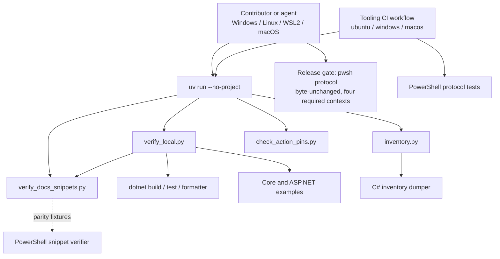

# Cross-Platform uv Tooling Layer - Plan

## Goal Capsule

- **Objective:** Any FunnySharp contributor or agent on Windows x64, Linux x64 (including WSL2), or macOS can run the repository's core verification and evidence-regeneration tooling without installing PowerShell, with the covered steps producing the plan's defined pass/fail verdicts and labeled a pre-check rather than release evidence.
- **Means:** Add a Python + uv tooling layer (PEP 723 scripts, pinned uv and Python, one hygiene pass, one informational tooling CI workflow) beside the untouched PowerShell release protocol (KTD1-KTD8).
- **Authority:** `docs/product-contract.md` is the product contract; `docs/release-readiness.md` and `eng/release-protocol.json` define the release gate this plan must not weaken; `docs/next-stage/baselines.md` owns inventory provenance.
- **Execution profile:** Land hygiene and pins first, then the snippet-verifier parity harness before its port, then the local entry, then inventory, then CI and docs. Treat the release-protocol family as frozen bytes.
- **Tail ownership:** Implementation owns local validation on at least one OS and records the manual WSL2 check. Pushes, PRs, ruleset changes, and releases remain separately authorized operations.
- **Stop conditions:** Stop for a new decision if preserving snippet-verifier parity requires changing the PowerShell verifier, if the release protocol or its four required contexts would need modification, if satisfying R11 would require a network dependency at run time, or if the inventory port cannot reproduce tracked third-party dumps byte-for-byte.

---

## Product Contract

### Summary

Add a Python + uv tooling layer that gives every supported developer environment a PowerShell-free path to core verification, documentation-snippet checking, and inventory regeneration, while PowerShell remains the only release-gate runtime and the release protocol stays byte-unchanged.

### Problem Frame

FunnySharp's release pipeline is already cross-platform: CI runs its PowerShell protocol on Windows, Linux, and macOS, and the scripts use OS-aware paths. The gaps are around it. `eng/next-stage-inventory/generate.sh` is POSIX-only, so inventory regeneration needs Git Bash or WSL on Windows. The documentation-snippet verifier and the repository's verification entry point are PowerShell-only, so a contributor or agent without `pwsh` cannot run them. Python already exists in the tree as two unpinned stdlib scripts, so there is no version story for Python tooling. And the root ignore/attribute files do not yet account for Python artifacts or LF stability.

The consequence is environmental: core checks are unreachable on some machines, evidence regeneration is not cross-platform, and any future Python tool risks tripping the release gate's clean-tree and source-fingerprint checks. The fix is a thin, pinned tooling layer beside the release gate, not a rewrite of the gate itself.

### Requirements

**Contributor verification without PowerShell**

- R1. Core local verification (build, tests, both examples, formatter check, and documentation-snippet verification) runs on Windows x64, Linux x64 including WSL2, and macOS with only the .NET SDK and uv installed.
- R2. The local entry reproduces, for its included steps (locked-mode restore, build, tests, both examples, formatter, and documentation snippets), the release protocol's verdict semantics: build requires zero warnings and errors, tests require a positive total with zero failed and zero skipped plus a passed result line for each test assembly, both examples must print their established success lines, and the formatter check must pass. Any other outcome exits non-zero; pack, performance, compatibility, and PowerShell-only steps are out of local scope and reported as not run.
- R3. Local output labels itself a pre-check and states that it is not release evidence.
- R4. Missing prerequisites (uv, the pinned Python interpreter, a matching .NET SDK) exit non-zero with actionable remediation, never a traceback and never a silent skip.

**Documentation-snippet parity**

- R5. A PowerShell-free snippet verifier is behaviorally equivalent to the release gate's PowerShell verifier for the same inputs: guide list, marker and fence rules, dedent, orphan-region failure, and exit status. The PowerShell verifier remains authoritative, and CI detects divergence between the two.

**Inventory regeneration**

- R6. Inventory regeneration is orchestrated cross-platform, keeping the existing C# dumper unchanged as the content engine and preserving the same eleven targets plus the language-ext type list.
- R7. Fail-closed behavior is preserved: every target failure is reported, any failure yields a non-zero exit plus an explicit incomplete-output statement, and partial success is never claimed.
- R8. Missing pinned inputs are distinguished from generation failures: each missing path is listed with remediation and a non-zero exit; a report-only input check exists; nothing is downloaded automatically.
- R9. Provenance is correct and durable: target titles and inputs are explicit data, the recorded title drift between the script and the committed dumps is resolved, and documentation that references the bash entry point is updated.

**Reproducibility, pins, and hygiene**

- R10. uv and Python versions have one machine-readable source of truth; local runs and CI fail explicitly on mismatch; CI actions are pinned by full commit SHA.
- R11. Tool scripts are self-describing (PEP 723), stdlib-only where practical, independent of the current working directory and of project discovery, and the tool scripts themselves require no network after the documented one-time setup (`uv python install`); dotnet steps keep normal first-use restore/build network behavior, and an explicit offline mode fails on a missing interpreter or dependency instead of downloading.
- R12. Generated text is byte-stable across operating systems (LF, UTF-8 without BOM, no timestamps or absolute paths), and Python run artifacts are ignored so the release clean-tree gate stays satisfiable.
- R13. A tooling workflow runs the Python checks and the existing PowerShell protocol tests on Ubuntu, Windows, and macOS with pinned tool versions and failure logs, without changing the release workflow.

**Protected boundaries**

- R14. The release protocol family (`eng/release-protocol.json`, `eng/Run-Release.ps1`, `eng/Verify-Release.ps1`, `eng/ReleaseProtocol.psm1`, `eng/tests/*.Tests.ps1`, `.github/workflows/release.yml`) and its four required contexts remain unchanged; no Python tool becomes a release-protocol step.
- R15. No shipping-package code, runtime dependency, product contract, or solution membership changes; tooling stays outside `FunnySharp.slnx` and every release artifact. The only package-content change is the one-line README tooling pointer, accepted in Risks and landed outside an active release-candidate window.
- R16. Contributor documentation covers setup, offline operation, WSL2, the parity policy, and the release-authority boundary.

### Success Criteria

- From a clean clone with the .NET SDK and uv installed, the documented one-time setup plus the local entry passes on each of the four environments, including one verified offline run after setup.
- Differential fixtures show the Python and PowerShell snippet verifiers agreeing on exit status for every enumerated case.
- The tooling workflow is green on Ubuntu, Windows, and macOS, while `eng/release-protocol.json`'s hash and the release workflow file are unchanged.
- Running any tool leaves `git status --porcelain --untracked-files=all` clean.

### Scope Boundaries

- **Outside this scope:** rewriting the PowerShell release protocol; making tooling a required check; adding third-party Python dependencies; shipping-package code or dependency changes; replacing the C# inventory dumper; regenerating the other committed inventory dumps; hardening the PowerShell snippet guard's fence-pattern limitation; WSL2 as a CI runner; moving the release workflow's deprecated macOS runner (a separately authorized release-contract change required before 2026-11-02). The local pre-check also excludes pack, performance, compatibility, and PowerShell-only release steps by design; the only planned package-content change is the README pointer carve-out in R15.
- **Deferred to Follow-Up Work:** capture a durable solution doc for the tooling/release split; extend Python pin enforcement if the frozen PowerShell test's coverage changes; promote the tooling workflow to a required check after the documented promotion criteria hold; decide the fate of remaining inventory provenance gaps such as the unreleased v5 dumps.

### Sources

- Repository: `eng/next-stage-inventory/generate.sh`, `eng/next-stage-inventory/api-inventory.csproj`, `eng/next-stage-inventory/Program.cs`, `examples/FunnySharp.DocumentationSamples/VerifyDocumentationSnippets.ps1`, `eng/release-protocol.json`, `eng/Run-Release.ps1`, `eng/Verify-Release.ps1`, `docs/release-readiness.md`, `docs/next-stage/baselines.md`, `docs/next-stage/inventory/bcl.md`, `.github/workflows/release.yml`, `.gitattributes`.
- External: uv script guide and settings (`docs.astral.sh/uv`), PEP 723 and the packaging-spec inline script metadata, `astral-sh/setup-uv` v10.1.0, `actions/runner-images` (macOS 14 deprecation, no preinstalled uv).

---

## Planning Contract

### Key Technical Decisions

- KTD1. **Python + uv tooling layer; PowerShell release gate unchanged.** (session-settled: user-approved — chosen over adding more POSIX shell tooling and over rewriting the release protocol: the CI-proven fail-closed gate stays intact while every supported environment gets one portable tooling stack.) Governs R1, R14, R15.
- KTD2. **Per-script PEP 723 metadata with a root `uv.toml` and root `.python-version`, run as `uv run --no-project <script>`; no `pyproject.toml` or lockfile in this stage.** Chosen over a shared tooling project with a committed lock: the scripts have zero third-party dependencies, so a lock owns nothing, while PEP 723 keeps each script self-contained and project-discovery-independent. Revisit when two or more scripts need shared dependencies. Governs R10, R11.
- KTD3. **Pin uv 0.12.16 and Python 3.12.x explicitly in machine-readable files; CI pins `astral-sh/setup-uv` v10.1.0 by full SHA and reads the same pin file rather than repeating the version.** The pin is exact rather than a range so every environment runs the same uv; the tooling guide owns the upgrade procedure that moves the pin files and CI together. Local runs enforce `required-version`, so a mismatch fails loudly instead of drifting. Governs R10, R13.
- KTD4. **The local entry reproduces the release protocol's verdict semantics, not merely exit codes, and stays tied to the frozen verifier by a marker contract.** `dotnet test` can exit zero with skipped tests, so the entry parses build, test, and example output for the success markers the release verifier requires. Because the verifier's verdict logic is inline and must stay frozen (R14), the tie is a marker contract rather than a callable differential: fixture logs prove the Python verdict rules, and a read-only guard asserts the marker literals still appear in the verifier source so a verifier change trips the tooling check. Parsing-logic drift without marker drift remains a recorded residual risk, and any change to the verifier's verdict logic must update the Python contract in the same change. Governs R2, R3, R14.
- KTD5. **The PowerShell snippet verifier stays authoritative; the Python port is behavior-equivalent and gated by differential fixtures in CI.** Chosen over single-sourcing the verifier in Python, which would push uv onto the release gate's path. The port mirrors the PowerShell input contract: a recursive `.cs` scan of the samples root excluding build directories, an explicit guide list, and `File.ReadAllLines` line handling including BOM and trailing-newline behavior. A change to the PowerShell verifier must update the Python port in the same change. Governs R5, R14.
- KTD6. **Inventory port is orchestration-only and faithful: the C# dumper keeps producing content, the target table becomes explicit data, and the eleven-target scope is preserved.** Chosen over rewriting metadata logic in Python or expanding to every committed dump, both of which would change evidence. Governs R6, R9.
- KTD7. **Inputs fail closed and outputs are explicit.** Missing pins are enumerated with remediation and exit non-zero; a report-only input check exists; nothing is downloaded; generated files go only to a caller-chosen directory (default outside the repository) with LF and UTF-8. Governs R7, R8, R12.
- KTD8. **Tooling CI is a new informational workflow with one stable aggregate job for future promotion.** The frozen PowerShell protocol test remains authoritative for release-workflow pinning; a Python pin check covers the non-release workflows and asserts that the tooling workflow consumes the pin files, instead of editing the protected tests. Governs R13, R14.

### High-Level Technical Design

The tooling layer is a set of dependency-free Python scripts that orchestrate the existing .NET SDK, the C# inventory dumper, and a behavior-equivalent port of the snippet verifier. It never enters the release path.



Authority flows one way: the release gate never calls a Python tool, and the PowerShell snippet verifier remains the reference implementation the Python port must match.

### Output Structure

```text
uv.toml                              # uv required-version and interpreter policy
.python-version                      # pinned Python for uv
eng/tools/
  verify_local.py                    # PowerShell-free local pre-check
  verify_docs_snippets.py            # behavior-equivalent snippet verifier
  inventory.py                       # cross-platform inventory orchestration
  check_action_pins.py               # full-SHA pin check for workflows
  tests/                             # Python unittest suites (incl. parity)
.github/workflows/tooling.yml        # informational 3-OS tooling workflow
docs/tooling.md                      # contributor tooling guide
```

### System-Wide Impact

- **Release source fingerprint and clean tree:** `eng/Run-Release.ps1` rejects untracked files and fingerprints tracked plus non-ignored untracked bytes before and after a run. Tooling files must be committed, run artifacts must stay ignored, and no tool may write outside ignored paths.
- **Attribute renormalization:** the LF rules for generated inventory paths must be verified with `git status` after the change, not only by reading attributes, so tracked dumps are not dirtied.
- **Package content:** `README.md` is packed into both NuGet packages and hash-compared to the repository copy, so the tooling pointer changes both package hashes and belongs outside an active release-candidate window.
- **Frozen release family:** `eng/release-protocol.json`'s hash is recorded in execution evidence and its PowerShell tests are release steps; new tests must not be added to `eng/tests/*.Tests.ps1` under this plan.
- **Inventory tracking:** the generated directory ignores machine dumps while tracked markdown and the type list stay in the repository; retiring the bash entry point must leave tracking and ignore rules intact.
- **Documentation cross-references:** the bash entry point is referenced by the inventory READMEs, the next-stage README, the baselines record, the BCL inventory memo, the language-ext inventory, the language-ext baseline analysis, and a historical review record. Live guides are updated; the historical audit record is preserved with a note.
- **Cross-platform behavior:** WSL2 uses Linux semantics; repository placement on a mounted Windows filesystem and interpreter interop are documented but not CI-verifiable.
- **CI contracts:** the four required contexts are exact; the tooling workflow must not reuse their names or modify the release workflow.

### Risks and Dependencies

- **uv bootstrap is a network step.** First use downloads uv and the pinned interpreter, and mirror allowlisting may be required in corporate environments; `system-certs` and proxy settings are documented. Mitigation: one-time setup is documented, CI installs uv through the pinned action, and script execution after `uv python install` requires no network (KTD3, KTD7).
- **Release runner end of life.** The release workflow's macOS 14 runner is deprecated and retires on 2026-11-02. This plan leaves `release.yml` frozen, so a separately authorized change must move that required context to a supported runner before the deadline; the tooling matrix's macOS 15 choice does not cover it. Runner labels are reviewed quarterly.
- **The exact uv pin can block contributors.** `required-version` fails hard, and package-manager installations cannot self-update. Mitigation: the tooling guide gives the standalone install path, the remediation text appears in the failure path, and the upgrade procedure is the release-safe way to move the pin.
- **macOS runner rotation.** `macos-14` is deprecated; the tooling matrix uses `macos-15`. The release workflow is unchanged and keeps its existing runners.
- **Parity drift between the two snippet verifiers.** An informational workflow cannot stop a future verifier edit from merging with a stale Python port. Mitigation: differential fixtures in CI, the same-change policy, the workflow's trigger set, and this recorded residual risk (KTD5).
- **README is packed into both NuGet packages.** Its one-line tooling pointer changes package content and the layout hash check; this is accepted because every release rebuilds and rehashes packages, and the release-readiness cross-path comparison is explicitly non-blocking. Land the pointer outside an active release-candidate window.
- **WSL2 cannot be exercised by CI.** Mitigation: WSL2 is treated as Linux, commands are documented, and the manual check is recorded with the implementation.
- **uv/Python upgrades require coordination.** Mitigation: one upgrade procedure that moves `uv.toml` and `.python-version` together (CI reads the pins rather than repeating them), with a three-OS install check.
- **Inventory inputs are external pins.** Mitigation: report-only `--check-inputs`, no downloads, and no CI step that regenerates commit-bound dumps for comparison.

### Alternatives Considered

- **Shared `eng/pyproject.toml` plus committed `uv.lock`** instead of PEP 723: rejected for now because the tooling has no third-party dependencies; a lock adds machinery without owning anything. Reconsider when shared dependencies appear.
- **Single-source the snippet verifier in Python** and let the release gate call it: rejected because it would make the release-gate runtime depend on uv and Python, violating R14's spirit. Parity keeps the gate independent.
- **Port the C# dumper's metadata rendering to Python:** rejected; byte-level output details (ordering, escaping, extension prefixes, enum rendering) are the tracked evidence contract and belong in the existing engine.
- **Make tooling a required check immediately:** rejected; the four required contexts are documented as exact, and a required addition is a contract change that needs its own decision after observation.

---

## Implementation Units

### U1. Tooling hygiene and version pins

- **Goal:** Make Python tool runs invisible to the release clean-tree and source-fingerprint checks, and give uv/Python a single pinned source of truth.
- **Requirements:** R10, R11, R12.
- **Dependencies:** None.
- **Files:** `.gitignore`, `.gitattributes`, `uv.toml`, `.python-version`.
- **Approach:**
  1. Add `__pycache__/`, `*.py[cod]`, and `.venv/` to the root ignore file.
  2. Add `text eol=lf` attributes for `*.py`, `*.toml`, `.python-version`, `docs/next-stage/inventory/generated/*.md`, and the language-ext type list; confirm with `git status` that currently tracked dumps are not dirtied by renormalization.
  3. Add `uv.toml` with `required-version` for the pinned uv release, managed-only interpreter preference, and manual interpreter downloads.
  4. Add `.python-version` with an exact 3.12.x patch that the pinned uv can install on all three OSes; confirm the patch is available per platform before committing.
  5. Have every tool script resolve the repository root from its own location and fail with remediation when invoked from outside it, so config discovery and `required-version` enforcement are deterministic.
- **Patterns to follow:** `global.json`'s single-pin convention; `eng/tests/*.Tests.ps1`'s use of explicit version literals; `docs/next-stage/call-sites-code/tools/.gitignore` for Python artifact names.
- **Test scenarios:**
  - After running any tool script, `git status --porcelain --untracked-files=all` is empty (edge: `__pycache__` created by an import).
  - A deliberately mismatched uv version fails with the `required-version` diagnostic (error path).
  - `git check-attr eol -- <new file types>` reports `lf` for each type (happy path).
- **Verification:** The clean-tree check passes after a full tool run; the pin files exist and are consumed by `uv run`.

### U2. PowerShell-free snippet verifier with parity fixtures

- **Goal:** Provide a Python snippet verifier whose behavior matches the release gate's PowerShell verifier, with a differential test suite that fails on divergence.
- **Requirements:** R5, R12.
- **Dependencies:** U1.
- **Files:** `eng/tools/verify_docs_snippets.py`, `eng/tools/tests/test_docs_snippets_parity.py`, `eng/tools/tests/fixtures/docs_snippets/` (or fixture trees generated into a temp root).
- **Approach:**
  1. Port the PowerShell verifier's rules exactly: explicit guide list, marker immediately preceding a csharp fence, common-indent dedent, duplicate/missing region handling, unused-region failure, excluded build directories, line-by-line equality.
  2. Mirror its input contract exactly: a recursive `.cs` scan of the samples root excluding build directories, an explicit guide list read from the repository, and `File.ReadAllLines` line handling. Give the Python verifier an explicit samples-root argument so fixtures can point it at a staged tree.
  3. Keep the guide list explicit in both implementations; do not switch to directory discovery in this unit.
  4. Build fixture trees covering the enumerated cases, including a staged copy of the PowerShell verifier and all eight guides, and run both implementations against each fixture, comparing exit status.
  5. Run both implementations against the real repository and compare the reported snippet count.
- **Execution note:** Write the fixture harness first and capture the PowerShell exit statuses before porting, so the port targets observed behavior rather than a reading of the script.
- **Patterns to follow:** `examples/FunnySharp.DocumentationSamples/VerifyDocumentationSnippets.ps1`; stdlib `argparse`/`pathlib`, explicit `newline="\n"` writes.
- **Test scenarios:**
  - Valid tree: both implementations exit 0 and report the same snippet count (happy path).
  - Duplicate scenario region: both exit non-zero (edge).
  - Missing closing snippet marker: both exit non-zero (edge).
  - Fence without a preceding marker: both exit non-zero (error path).
  - Region referenced twice: both exit non-zero (error path).
  - Declared region never referenced: both exit non-zero (error path).
  - CRLF line endings in a fixture guide: both agree (integration).
  - A guide file with a UTF-8 BOM, and one without a trailing newline: both agree (edge).
  - Indented or attributed fence: both treat it the same way, including any known skip (edge).
  - `pwsh` unavailable locally: the parity test skips with an explicit reason; CI never skips (integration).
- **Verification:** On the real repository the Python verifier reports the same count as the PowerShell verifier; the fixture suite is green in CI on all three OSes.

### U3. PowerShell-free local verification entry

- **Goal:** One command runs the core local checks with release-equivalent verdict semantics and an explicit "pre-check, not release evidence" label.
- **Requirements:** R1, R2, R3, R4.
- **Dependencies:** U1, U2.
- **Files:** `eng/tools/verify_local.py`, `eng/tools/tests/test_verify_local.py`.
- **Approach:**
  1. Mirror the release protocol's included steps with their normal command forms: locked-mode restore, build, tests, both examples, and the formatter check, using the ordinary NuGet cache and not the release isolation flags.
  2. Parse each step's output with the release verifier's success markers and fail otherwise: build success plus zero warnings and errors; a positive test total with zero failed and zero skipped plus a passed result line for each test assembly; both example success lines; a clean formatter result.
  3. Add a marker-contract suite that proves the Python verdict rules against fixture logs, plus a read-only guard asserting the expected marker literals still appear in `eng/Verify-Release.ps1`; the guard needs `pwsh` or plain text reading only and never edits the verifier.
  4. Run the Python snippet verifier as the docs step and report every release-protocol step outside local scope as not run, including pack, benchmark preflight and benchmark, performance verification, compatibility, and the PowerShell-only protocol tests.
  5. Support an offline mode and a machine-readable summary; use stable exit codes for pass, check failure, and environment/setup failure.
  6. Reject a missing or mismatched uv/Python/.NET environment, or invocation outside the repository root, with remediation text.
- **Patterns to follow:** `eng/release-protocol.json` step arguments; `eng/Verify-Release.ps1` verdict parsing; existing PowerShell test output conventions (`PASS <name>` lines).
- **Test scenarios:**
  - All-green fixture logs produce exit 0 and a pass summary (happy path).
  - Build log with a warning and an error: exit non-zero, names the failing check (error path).
  - Test summary with zero total, with `total != succeeded`, with a skipped test, or missing a per-assembly passed line: exit non-zero (edge).
  - Either example output missing `FunnySharp examples passed.` or `FunnySharp ASP.NET Core example endpoints mapped.`: exit non-zero (error path).
  - Docs step not reporting `Verified N C# documentation snippets across 8 primary guides.`: exit non-zero (error path).
  - The not-run summary lists every out-of-scope release step (pack, benchmark preflight and benchmark, performance verification, compatibility, PowerShell-only protocol tests) (edge).
  - Verifier marker guard: a fixture verifier source missing one expected marker fails the guard (error path).
  - Missing uv or interpreter, or invocation outside the repository root: environment-failure exit with remediation text (error path).
  - Offline flag: passes through to the underlying commands and never triggers a network-dependent step in the tool scripts (integration; dotnet restore/build may still need network on first use).
  - Formatter check failing: exit non-zero (error path).
  - Tool interrupted mid-run: `git status --porcelain --untracked-files=all` is still empty (edge).
- **Verification:** The entry passes on a clean checkout on the implementing OS and in the tooling CI matrix; fixture logs prove each failure arm, and the marker guard fails when the verifier source loses an expected marker.

### U4. Cross-platform inventory orchestration

- **Goal:** Provide a cross-platform Python orchestrator that reproduces the bash inventory entry point's behavior and preserves its fail-closed evidence contract.
- **Requirements:** R6, R7, R8, R12.
- **Dependencies:** U1.
- **Files:** `eng/tools/inventory.py`, `eng/tools/tests/test_inventory.py`.
- **Approach:**
  1. Represent the eleven targets and the type list as explicit data with their assemblies, modes, include filters, resolve directories, and titles, so provenance lives in data rather than script line positions.
  2. Resolve environment inputs with the same names and defaults as the bash script, deriving the Roslyn directory from the installed SDK instead of a hard-coded patch path, while keeping an override.
  3. Preflight every required input, reporting each missing path with remediation; add a report-only input-check mode; never download.
  4. Build the C# dumper and fail immediately, without aggregation, when that build fails, matching the bash entry's early exit.
  5. Invoke each target, aggregate failures, and exit non-zero with the explicit incomplete-output statement when any target fails.
  6. Write outputs only to the caller-chosen directory, defaulting outside the repository; reject the repository root and reparse points as output targets.
  7. Normalize every dumper-produced file and captured stdout to LF and UTF-8 without BOM after each target: the C# dumper's `AppendLine`/`Console.WriteLine` emit the OS newline, so Windows would otherwise produce CRLF and break byte stability.
- **Patterns to follow:** `eng/next-stage-inventory/generate.sh` targets and failure semantics; `generate.sh` environment variable names; `Run-Release.ps1`'s containment checks for output paths.
- **Test scenarios:**
  - Target table matches the legacy script's eleven invocations and filters, checked structurally (happy path).
  - Missing baseline, ref-pack, Roslyn, or assembly paths: every missing path listed, exit non-zero, nothing generated (error path).
  - Input-check mode with missing inputs: reports and exits non-zero without building or writing (edge).
  - Dumper build failure: exits immediately non-zero without running targets (error path).
  - One target fails: remaining targets still reported, final exit non-zero with the incomplete statement (error path).
  - Output directory omitted, set to the repository root, or containing a reparse point: rejected with remediation (error path).
  - The normalizer rewrites CRLF and BOM bytes in a captured dumper-output fixture to LF/UTF-8, and with pinned inputs present the real regeneration path ends with LF-only files (edge).
- **Verification:** With pinned inputs present (acquisition is documented in `docs/next-stage/baselines.md`), regenerated third-party dumps are byte-identical to the committed ones; without inputs, the preflight message is actionable and no files are written.

### U7. Retire the bash inventory entry and repoint references

- **Goal:** Leave one cross-platform inventory entry point, with provenance references corrected and the historical record handled by an explicit policy.
- **Requirements:** R9, R16.
- **Dependencies:** U1, U4.
- **Files:** deletion of `eng/next-stage-inventory/generate.sh`; title-data updates in `eng/tools/inventory.py`; updates in `eng/next-stage-inventory/README.md`, `docs/next-stage/README.md`, `docs/next-stage/inventory/generated/README.md`, `docs/next-stage/baselines.md`, `docs/next-stage/inventory/bcl.md`, `docs/next-stage/inventory/language-ext.md`, `docs/next-stage/analysis/baseline-language-ext.md`; the historical-record replacement note in `docs/next-stage/review/final-review.md`.
- **Approach:**
  1. Decide and record the title/provenance direction for commit-bound dumps: the committed dumps carry a completion label while the bash script carried a commit label. Encode the chosen labels in the orchestrator's target data.
  2. Delete the bash entry point and update every live guide to the Python entry.
  3. Anchor the BCL memo's citations to target names instead of script line numbers.
  4. Preserve the historical review record (`docs/next-stage/review/final-review.md`) and add a one-line note that the cited entry point was replaced; state this historical-record policy in the tooling guide. If changed titles invalidate tests or documentation that assert the old labels, update them in this unit.
- **Patterns to follow:** `docs/next-stage/baselines.md` provenance style; existing guide command blocks.
- **Test scenarios:**
  - Searching the repository for the old script name returns only the chosen historical-record policy result (edge).
  - Every updated guide command runs the Python entry (integration).
  - Tracking and ignore rules for generated dumps are unchanged (edge).
- **Verification:** No live document points at the deleted entry; committed dumps and their tracking are unchanged.

### U5. Tooling CI workflow and pin enforcement

- **Goal:** Prove the tooling on Ubuntu, Windows, and macOS on every change, and enforce full-SHA action pinning for workflows.
- **Requirements:** R10, R13, R14.
- **Dependencies:** U2, U3, U4.
- **Files:** `.github/workflows/tooling.yml`, `eng/tools/check_action_pins.py`, `eng/tools/tests/test_check_action_pins.py`.
- **Approach:**
  1. Matrix over Ubuntu, Windows, and macOS 15 with `fail-fast: false`; checkout, then the SHA-pinned uv setup that reads the uv pin file rather than repeating the version, then .NET setup from `global.json`.
  2. Triggers cover the tooling files, the documentation samples, the workflow files, and the tooling guide; the workflow must not gate on path filters because that would leave a future required check pending.
  3. Steps: install the pinned interpreter, run the Python suites including snippet parity and the marker-contract suite, run the local verification entry, run the pin check, and run the existing PowerShell protocol tests directly so the workflow covers them without invoking the release runner; upload logs on failure with a bounded retention.
  4. Add a single aggregate job that runs unconditionally, depends on the matrix, and carries the stable name intended for future promotion, so promotion registers one check rather than matrix legs.
  5. Disable uv caching, because the scripts have nothing to cache and a cache-path miss can fail the job.
  6. Implement the pin check in Python over the non-release workflows: assert full-length commit SHAs with version comments and assert that the tooling workflow consumes the pin files; release-workflow pinning stays with the frozen PowerShell protocol test.
- **Patterns to follow:** `.github/workflows/release.yml` job structure, timeouts, `if: always()` evidence upload, and `retention-days: 7`; SHA-pinned actions with version comments.
- **Test scenarios:**
  - Pin-check fixture with a tag ref fails; a 40-hex SHA passes; a SHA without a version comment fails; an unpinned action from a non-`actions` owner fails; a local path action passes (happy/error paths).
  - Pin check over the real workflows passes and its scope test proves `release.yml` handling remains with the PowerShell test (integration).
  - Workflow YAML uses no required release context names and the aggregate job name is stable (edge).
  - Parity and marker-contract tests run (not skip) on all three runners (integration).
  - Both protocol test scripts run and pass on all three matrix legs (integration).
- **Verification:** The workflow is green on a test branch across the three OSes; `git diff` shows no change to `release.yml` or the protocol family.

### U6. Contributor documentation and provenance updates

- **Goal:** Document the tooling/release split, setup, offline and proxy behavior, WSL2, parity policy, upgrade procedure, and the workflow's promotion path.
- **Requirements:** R16, R3, R11.
- **Dependencies:** U5, U7.
- **Files:** `docs/tooling.md`, `docs/release-readiness.md`, `README.md`.
- **Approach:**
  1. Write the tooling guide: the release/Python authority split, per-OS one-time setup including `uv python install`, explicit offline operation (the tool scripts need no network after setup; dotnet restore/build may need it on first use), certificate and proxy settings, the exact-pin upgrade procedure, WSL2 guidance (Linux filesystem, no Windows interpreter interop), the parity, marker-contract, and same-change policies, the historical-record policy, and the "pre-check is not release evidence" statement.
  2. Record the workflow's promotion criteria and monitoring expectation: consecutive green matrix runs, zero parity or marker-contract skips, no infrastructure-only reruns, bounded duration, and a named owner; an informational failure is triaged within a working day and not left red beyond a week.
  3. Point the release-readiness commands section at the local pre-check as optional context, without weakening the release command, and note that the README pointer changes package bytes so it lands outside a release-candidate window.
  4. Add the one-line README pointer.
- **Patterns to follow:** `docs/release-readiness.md` tone (fail-closed, explicit); `docs/next-stage/baselines.md` provenance style.
- **Test scenarios:**
  - Searching for the old script name returns only the documented historical-record policy result (edge).
  - Documented commands run as written on the implementing OS, including one offline invocation (integration).
  - README link resolves (happy path).
- **Verification:** A contributor following only the guide reaches a passing local pre-check on a clean machine; documentation statements match the implemented behavior; the promotion criteria are written down.

---

## Verification Contract

| Check | Where | Done signal |
| --- | --- | --- |
| Python tooling suites (unit + snippet parity + marker contract + pin check) | `uv run --no-project python -m unittest discover -s eng/tools/tests` locally and in tooling CI | All suites pass on Ubuntu, Windows, and macOS; parity and marker-contract suites run (never skip) in CI |
| Local pre-check | `uv run --no-project eng/tools/verify_local.py` | Exit 0 on a clean checkout; fixture-driven tests prove each failure arm; the not-run summary names every out-of-scope step |
| Offline execution | After one-time setup, an explicit offline run of the snippet verifier and the inventory input check | Both succeed without network; a missing interpreter fails with the offline diagnostic instead of downloading |
| Clean-tree protection | `git status --porcelain --untracked-files=all` after tool runs | Empty output |
| Release-family protection | `git diff` over the protected files and the recorded protocol hash | No diff; protocol hash unchanged |
| Existing repository gates | Current `dotnet build`/tests/examples and the PowerShell release runner | Unchanged behavior; 416 core and 25 ASP.NET tests pass |
| Tooling CI visibility | The new workflow on a test branch | Green across the three OSes including both PowerShell protocol tests; informational only; aggregate job name stable for future promotion |
| Provenance references | Search for the old script name | Only the documented historical-record result remains; live guides point at the Python entry |
| WSL2 manual check | Documented commands inside WSL2 | Recorded outcome with the implementation |

## Definition of Done

- Every requirement R1-R16 is true, verified by the checks above.
- The release protocol family is byte-unchanged and still exposes exactly its four required contexts.
- No Python tool run leaves untracked files, and the release clean-tree precheck remains satisfiable after any tooling run.
- The Python snippet verifier matches the PowerShell verifier on every fixture and on the real repository.
- Inventory regeneration reproduces tracked third-party dumps byte-for-byte when pinned inputs are present, and fails closed with actionable messages when they are not.
- `docs/tooling.md` and every updated reference describe the implemented behavior; no live document references the retired bash entry point, and the historical audit record carries its replacement note.
- The workflow's promotion criteria, monitoring expectation, and aggregate check name are documented while the workflow remains informational.
- The release runner end-of-life remediation is recorded as a separate authorized change rather than silently absorbed.
- Cleanup: no compatibility shim, dead flag, unused fixture, or abandoned experimental script remains in the diff; deferred items live only under Deferred to Follow-Up Work.
